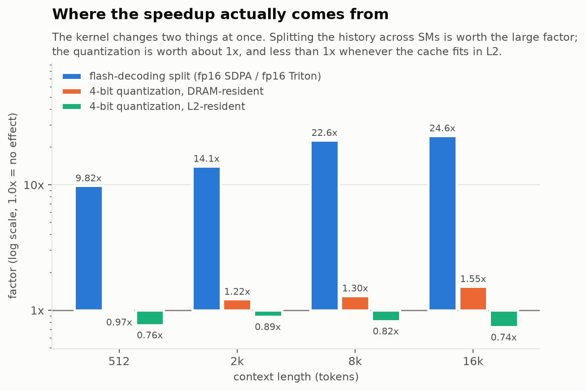
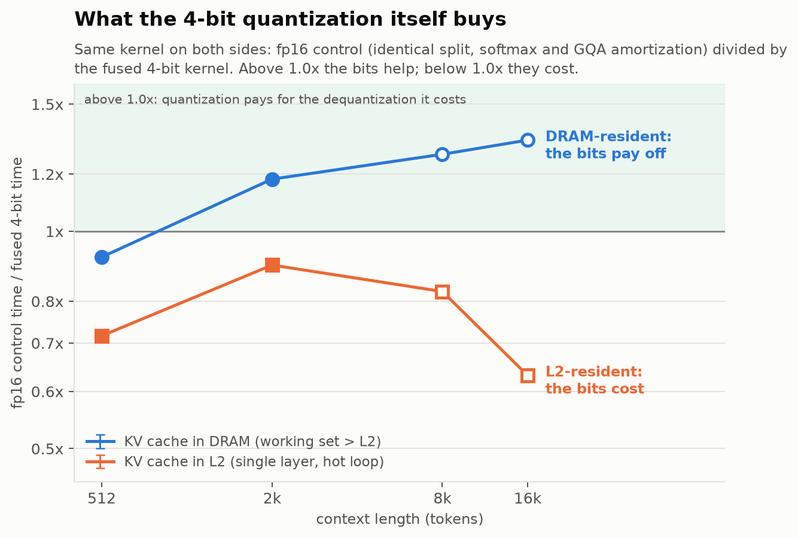
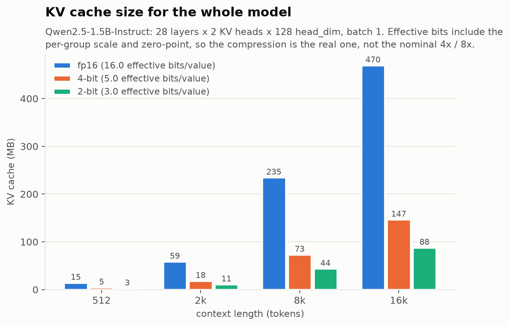
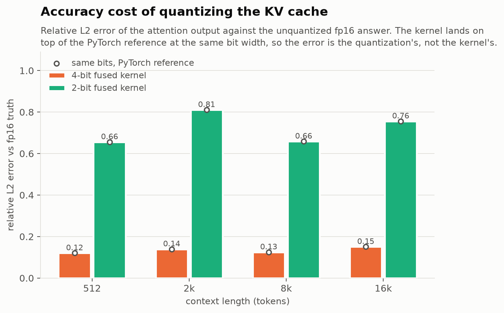
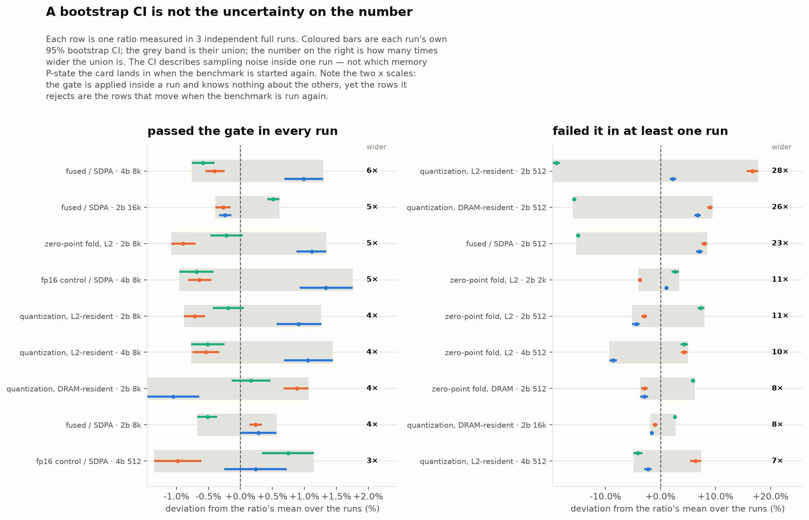

# Fused Triton kernel for quantized-KV decode attention

A Triton kernel that computes one decode step of attention **directly on a
packed 2/4-bit KV cache**, without ever materializing a full-precision copy of
the history.

**Status: the kernel is correct, well tested, and slower than an unquantized
kernel of the same shape whenever the KV cache fits in L2.** That is the result,
and it is not the one the project set out to find. Every timing below is
clock-verified on a laptop GPU whose clock range is wider than the effects being
measured — see [Results](#results) and [What is not true](#what-is-not-true-yet).
No number here should be quoted without the condition attached to it.

---

## The problem

A naive quantized KV cache does this on every decode step:

```python
K_fp16 = dequantize(K_packed)     # writes S x D fp16 to DRAM
V_fp16 = dequantize(V_packed)     # writes S x D fp16 to DRAM
out    = attention(q, K_fp16, V_fp16)   # reads them straight back
```

Decode attention is memory-bound — one query row against the whole history — so
that round trip through DRAM is close to *all* of the cost. Per cached
element-row the naive path moves `0.5·D` (read packed) + `2·D` (write fp16) +
`2·D` (read it back) = **4.5·D bytes**, where a fused kernel moves **0.5·D**.

Why it is non-trivial: to feed `tl.dot` the kernel needs a dense `(BLOCK_N, D)`
tile of dequantized K, but a load of packed codes gives `(BLOCK_N, D/P)` bytes,
and Triton cannot slice-assign into a tile. The two obvious ways out — a
`tl.join`+`tl.reshape`, or `P` unrolled accumulators — cost a shared-memory
layout conversion or depend on fragile constexpr unrolling.

**The way around it** is to not reconstruct the tile at all, but *address* it.
Codes are packed "split-P", so byte `j` holds dims `j, j+DP, j+2·DP, …`. The
kernel builds an index vector over the full head dim and loads byte `d % DP`
with shift `(d // DP)·nbits`. Each byte is loaded `P` times, but those loads hit
the same cache line, so DRAM traffic is unchanged and the result is a dense
`(BLOCK_N, D)` tile with no reshape, no transpose, and no unrolled accumulators.

The kernel is flash-decoding shaped: the history is split across programs, each
computing a partial online-softmax result, reduced by a second tiny kernel. One
program owns one KV head and *all* the query heads sharing it, so the unpack is
paid once per GQA group rather than once per query head.

---

## Results

Measured on the machine described under [Reproducing](#reproducing). Shapes are
Qwen2.5-1.5B-Instruct's attention (`HQ=12, HKV=2, D=128`, GQA group 6), batch 1,
one attention layer, `group_size=32`.

### The honest headline

The fused kernel beats PyTorch's fp16 SDPA by 9.5–38×. **That number is
misleading and should not be used.** It changes two things at once: the cache is
4-bit *and* the work is split across the history. PyTorch's SDPA does no split
for `q_len == 1`, so a fused-vs-SDPA comparison silently credits the
quantization for a parallelization win.

`kernels/fp16_decode_attn.py` exists to separate them. It is the same kernel —
same split, same online softmax, same GQA amortization, same combine kernel —
reading plain fp16. The only difference is the dequantization.



**Splitting the history is worth 10.5–26×. The quantization is worth 0.73–1.48×**,
and which side of 1.0 it lands on depends on whether the cache fits in L2.

**Hot regime (cache fits in L2), µs per decode step, CUDA-graph replay:**

| ctx | SDPA fp16 | Triton fp16 (control) | fused 4-bit | fused 2-bit | flash-decode effect | quantization effect |
|---|---|---|---|---|---|---|
| 512 | 46.4 | 3.3 | 4.6* | 5.9* | 14.0× | 0.73× |
| 2048 | 174.9 | 6.7* | 8.2* | 7.9* | 26.2× | 0.81× |
| 8192 | 734.7 | 13.5 | 17.1 | 16.8 | 54.3× | **0.79×** |
| 16384 | 1456.9 | 21.3 | 29.2 | 29.3 | 68.4× | **0.73×** |

**Quantization makes the kernel 1.23–1.37× slower here, not faster.** Nearly the
whole apparent win is the split.

**Cold regime (rotating working set, 3× L2 = 101 MB), µs per decode step:**

| ctx | SDPA fp16 | Triton fp16 (control) | fused 4-bit | fused 2-bit | flash-decode effect | quantization effect |
|---|---|---|---|---|---|---|
| 512 | 49.0 | 4.6 | 5.1* | 6.4* | 10.5× | 0.90× |
| 2048 | 179.6 | 11.8* | 9.7* | 9.3* | 15.3× | 1.21× |
| 8192 | 735.6 | 32.8 | 22.2 | 20.7 | 22.4× | **1.48×** |
| 16384 | 1464.1 | 55.6 | 38.6 | 35.8 | 26.3× | **1.44×** |

`*` = did not pass the clock-verification gate (see below) and is not quoted as
evidence anywhere; every conclusion here rests on unstarred rows.

The sign flips: once the cache genuinely comes from DRAM, 4-bit leads — but by
**1.21–1.48×, not by an order of magnitude**.

**At ctx = 8192 the sign flip is fully clock-verified in all three runs**, with
SDPA, the fp16 control and the fused kernel passing the gate at the same context
every time: **0.79–0.81× L2-resident, 1.469–1.478× DRAM-resident** (the ranges
are across the three runs, not a within-run CI — see below). It is the only
context where that is true of all three runs; 512 and 2048 clear it in one run
and not the others, which is a fact about the card's mood and not about the
kernel. Earlier versions of this claim rested on rows where the control had
failed the gate.



**So the real claim is conditional: the fused kernel pays for itself only when
the KV cache does not fit in L2, and costs 1.23–1.37× when it does.** At 512
tokens quantization loses in *both* regimes — there is not enough history to
amortize anything.

### The inner loop was mostly loading the same 4 numbers over and over

The per-group scale and zero are `(BLOCK_N, head_dim/group_size)` in memory — 4
values per token at `group_size=32`. The kernel used to load them as
`(BLOCK_N, head_dim)` by indexing with `d // group_size`, **re-reading each
parameter 32 times**, four times per loop iteration (K and V, scale and zero).
Loading them at their real width and expanding in registers is bitwise
identical — asserted over 40 cases of (S × nbits × group_size), not merely
close:

| | instructions | registers | spills |
|---|---|---|---|
| gather (`d // group_size`) | 2245 | 244 | 0 |
| broadcast | **1653** | **128** | 0 |

Worth 1.16–1.48× L2-resident and 1.05–1.32× DRAM-resident, biggest where the
kernel is issue-bound rather than bandwidth-bound. The old path is kept as a
permanent benchmark row (`fused_gather_meta_*`) so the attribution stays
auditable.

**This refutes a claim that used to be on this page.** It said: *"Group size
barely moves it (25.4 / 25.6 / 26.6 µs at gs = 16/32/64), so the scale+zero tile
loads are not the cost."* The measurement was right and the inference was wrong.
In the gather path the load is indexed by `d // group_size` over the **full**
head dim, so it issues `BLOCK_N × head_dim` loads *whatever the group size is* —
group size changes how many distinct values are read, never how many
instructions are issued. The experiment varied metadata **bytes** and concluded
about metadata **instructions**, and a flat sweep is exactly what the expensive
version predicts.

### …and then the same experiment, run properly, refuted half of *that*

`sweep_group_size.py` re-runs the sweep on **both** paths at once, with the
prediction written down first: broadcast should now be sloped, because there
`group_size` really does set the load count; gather should stay flat. Gather was
flat. Broadcast was **also nearly flat** — 1.07–1.17× across an 8× range of
metadata loads. The prediction was wrong, and the right shape is *saturation*
(L2-resident, ctx = 8192, all rows clock-verified):

| path | metadata loads per tile | median |
|---|---|---|
| gather, gs=32 | 4096 | 22.0 µs |
| broadcast, gs=16 | 256 | 17.0 µs — 16× fewer loads buys **1.29×** |
| broadcast, gs=128 | 32 | 15.9 µs — a further 8× buys **1.07×** |

So metadata loads are a real cost and they stop being the *binding* cost about
an order of magnitude below where the gather path sat. The broadcast change was
worth 1.29× because it crossed that point, not because load count and time are
proportional. A version of this project that had only run the second half of
that table would have concluded metadata loads were free — which is exactly the
mistake the first sweep made, from the other side.

### The gs=128 outlier was a shared-memory layout conversion

The old sweep had a loose end nobody chased: 93 µs at `gs=128`, against ~26 µs
everywhere else. It reproduces, and it is now explained.

On the gather path at `gs=128` the kernel is **1.95× / 2.88× / 3.52×** slower
than at `gs=64` (ctx = 512 / 2048 / 8192, L2-resident, IQR ≈ 1%). It issues
*fewer* PTX instructions than `gs=64` (2415 vs 2989) and exactly the same number
of global loads, so it is not a load-count effect. What moves is shared memory:
at the swept config (`block_n=32`, 2 warps) `st.shared` goes **30 → 142**. The
same jump appears in all nine (`block_n`, `num_warps`) combinations checked by
`probe_gs128.py` — 16 → 72 at 4 warps, 40 → 264 at `block_n=128` — so it is a
property of the index, not of one tuning.

The cause is the degenerate index. When `group_size == head_dim`,
`tl.arange(0, D) // group_size` folds to all-zeros, and Triton gives the loaded
tile a layout that must be converted through shared memory before it can feed
the dequantize path. The redundant-load form is slow; the redundant-load form
with a *constant* index is much slower, and it gets worse with context because
the conversion is inside the loop. The shipped broadcast path is unaffected — at
`gs=128` it is the *fastest* cell in the table — so this is a fact about the
control, not about the kernel.

Two variants were measured and **rejected**, which is what bounds the claim:

- **Folding the zero-point out of the inner loop** (`scale·(q·code) + zero·Σq`,
  a per-group dot against the raw codes). Not faster at any context in either
  regime: 0.72–1.08× at 4-bit, 0.67–0.94× at 2-bit. The only cell above the
  1.05× bar (4-bit, DRAM-resident, ctx=8192) sits on a row that failed the
  clock/dispersion gate, and the audit now says so instead of quoting it. Kept
  as an option
  (`fold_zp=True`) only because it is *more accurate* — it never rounds a
  dequantized K value to fp16, so kernel error stays flat at 1.5e-4 instead of
  drifting 2.3e-4 → 7.7e-4 as context grows.
- **The same narrow-load trick applied to the packed codes.** Bitwise identical
  and a **loss** (0.69–0.96× at ctx ≥ 8192); registers go 128 → 223. The codes
  are needed at full width regardless, so expanding them from a narrow load adds
  a live tile without removing one. Reverted. The lesson generalizes less than
  it first looks: the win is specific to loads whose expanded form is redundant.

### Every timing on this page is clock-verified

An earlier version of this README reported the cold regime as an **11–15×** win
for quantization. That was wrong, and the way it was wrong is worth stating.

This is an 80 W laptop GPU that idles at 285 MHz and boosts to 3090 MHz — a
9× range, larger than most effects being measured here. The fp16 control kernel
is fast enough that its measurement finished while the GPU was still at idle
clocks, so the control looked ~12× slower than it is, and the quantization
looked ~12× better than it is. Nothing in the old benchmark could see this,
because it never asked what the clocks were doing.

`benchmark.py` now runs a background `nvidia-smi` sampler, deliberately spins the
GPU up to ≥ 80% of maximum before *every* measurement, and attributes the clock
samples to the sampling loop only — warmup and CUDA-graph capture are excluded,
so they neither look like throttling nor hide it. A row is **quotable** only if

1. every clock sample during its sampling loop was ≥ 70% of the 3090 MHz
   maximum,
2. the timing's own IQR was ≤ 5% of its median, and
3. **its clock window holds at least 4 samples.**

The last full run: **25 of 48 rows quotable**. The rejects are named in
`results/benchmark.json` under `clock_monitoring.rejected_rows` and are starred
in the tables above. **Every one of them is dispersion; there are no clock
rejections left.**

#### The gate had a second failure mode underneath the first one

Adding the clock monitor caught throttling. It did not catch *not having looked
long enough to tell*, and a gate that answers "the GPU was boosted" from one
sample reads exactly like one that answers from twenty.

Two things were wrong, and the fix for the first exposed the second:

- **The ramp was being spent before the measurement began.** `warm_clocks()` ran
  in the driver, but the timing function then did warmup, CUDA-graph capture and
  priming replays before opening its clock window — a long CPU-bound stretch
  with the GPU near idle. A slow PyTorch baseline re-boosts inside its own first
  sample; a 14 µs kernel never does, so **the gate was penalising methods for
  being fast**, which is the opposite of the failure it was built to catch. The
  ramp now runs *inside* the timing function, after capture.
- **28 of 96 measurement windows were being judged on a single `nvidia-smi`
  sample** — including rows the attribution rests on. `nvidia-smi -lms 100`
  actually delivers ~9 Hz (109 ms median gap, measured), so a 30 ms measurement
  cannot earn evidence about clocks at all. Windows are now held open ≥ 1.5 s and
  must carry ≥ 4 samples, reported as its own failure mode rather than passing
  silently. Windows with ≤ 1 sample: **28 → 0**; the minimum is now 13.

An earlier attempt bounded that stretch by *sample count* rather than time,
which silently bound first for exactly the fast kernels that needed it — their
samples are cheap, so 600 of them is 0.26 s. The unit mattered.

### Memory

Exact, not measured — these follow from the format.

| format | effective bits/element | cache @ ctx=512 (1 layer) | vs fp16 |
|---|---|---|---|
| fp16 | 16.0 | 0.52 MB | 1.0× |
| 4-bit, gs=32 | **5.0** | 0.16 MB | **3.2×** |
| 2-bit, gs=32 | **3.0** | 0.10 MB | **5.3×** |

4-bit with an fp16 scale and zero per 32 elements is **5.0** bits/element, not
4. Every memory claim here quotes the effective number, so the compression is
3.2×, not 4×.



This is the one unconditional win: at 16k tokens the whole-model KV cache is
470 MB in fp16, 147 MB at 4-bit, 88 MB at 2-bit. The fused kernel also
allocates nothing to get there — 0.3 MB of transient workspace at 16k, against
117 MB for dequantize-then-SDPA, which has to materialize the fp16 cache.

### Correctness

`python -m pytest test_correctness.py -q` → **106 passed in ~123 s**.

Two different errors are measured, and the distinction is the whole point:

- **Kernel error** — fused kernel vs. dequantize-then-attend in fp32 on the
  *same* dequantized values. Any difference is the kernel's own arithmetic.
- **End-to-end error** — vs. attention on the unquantized fp16 cache. This is
  dominated by the quantizer, not the kernel.

| ctx | bits | cosine (kernel vs dequant ref) | rel L2 | kernel vs fp16 truth | baseline vs fp16 truth |
|---|---|---|---|---|---|
| 512 | 4 | ≥ 0.9999999 | ≤ 4.18e-04 | 1.207e-01 | 1.208e-01 |
| 2048 | 4 | ≥ 0.9999999 | ≤ 4.75e-04 | 1.396e-01 | 1.397e-01 |
| 8192 | 4 | ≥ 0.9999988 | ≤ 1.59e-03 | 1.251e-01 | 1.249e-01 |
| 16384 | 4 | ≥ 0.9999992 | ≤ 1.28e-03 | 1.509e-01 | 1.514e-01 |
| 512 | 2 | ≥ 0.9999998 | ≤ 5.98e-04 | 6.558e-01 | 6.560e-01 |
| 2048 | 2 | ≥ 0.9999996 | ≤ 8.71e-04 | 8.110e-01 | 8.105e-01 |
| 8192 | 2 | ≥ 0.9999996 | ≤ 8.44e-04 | 6.589e-01 | 6.585e-01 |
| 16384 | 2 | ≥ 0.9999995 | ≤ 9.01e-04 | 7.560e-01 | 7.557e-01 |

Thresholds are asserted, not eyeballed: `cosine ≥ 0.99999`, `rel L2 ≤ 5e-3`, and
the kernel's end-to-end error must be within 1.5× of the PyTorch baseline's.
The suite also covers pack/unpack roundtrip exactness, a half-quantization-step
reconstruction bound, GQA and MHA shapes, group sizes 16–128, block sizes
16–128, split counts 1/2/5/17/64 (uneven on purpose), S=1, extreme scores, and a
worst-single-element check that aggregate cosine would hide.



Test inputs inject 1% heavy-tailed outliers at 8× magnitude, because pure
Gaussian noise is an unrealistically easy input for a quantizer and would
flatter these numbers.

### Self-audit

`audit_claims.py` writes down every claim this project could make, then attacks
it. Speedups are judged by a bootstrap 95% CI over the raw per-sample timings
against a 1.05× practical-significance bar, so a difference that is really
run-to-run jitter cannot be reported as a win.

The audit now also adjudicates each kernel change against its **own** control
rather than against PyTorch — `optimization.meta_broadcast` (the metadata
broadcast, versus the same kernel with the gather) and
`optimization.zero_point_fold` (which it marks `FALSE` on speed, since it clears
the 1.05× bar at no context in either regime).

Current run against `results/benchmark.json` (2026-09-02 12:21, the third of
three back-to-back full runs — "the last one" rather than "the best one", which
is the only selection rule that cannot be gamed after the fact; it is also the
run with the fewest quotable rows of the three): **69 claims — 26 TRUE / 20 TRUE
BUT CONDITIONAL / 11 MISLEADING / 12 FALSE.** Eight claims moved from conditional to established when the clock
ramp was fixed, and none of them because a threshold was relaxed.
Regenerate with `./.venv/Scripts/python.exe audit_claims.py` (~20 s) and read
`results/audit.md`. Two of those verdicts moved this session for reasons that
were in the auditor rather than in the kernel:

- `optimization.*` crashed on a tuple-indexing bug, so the per-optimization
  claims had never actually been generated.
- `optimization.zero_point_fold.4b` came out `TRUE BUT CONDITIONAL` on a
  DRAM-resident 1.08× at ctx=8192 — on a row that had failed the clock and
  dispersion gate. That claim now applies the same gate as its neighbour and
  reads `FALSE`, like the 2-bit one always did.

### The confidence intervals were too narrow

Every CI here was an i.i.d. bootstrap. `analyze_dispersion.py` measures lag-1
autocorrelation of up to **0.72** on these timing series — the card wanders
rather than jittering — so the samples are not independent and the i.i.d.
interval is up to **1.95× narrower** than the data supports. Since every verdict
turns on whether an interval clears a bar, too narrow is too confident, in the
flattering direction. The resample is now **circular-block**.

Two corrections landed inside that fix. *Moving* blocks under-weight the ends of
a series, which shifts an interval's centre rather than its width, and that alone
promoted one claim from `CONDITIONAL` to `TRUE`; circular blocks weight every
sample equally. That still did not settle it, because the claim was on a knife
edge — its CI low moved from 1.04973 to 1.05019 against a 1.05 bar. `_verdict`
was a step function evaluated at the threshold, so any rounding decision became a
verdict; it now requires the deciding endpoint to clear the bar by at least 10%
of the interval's own width.

With both in place, **no verdict changes.** The correlation correction moved
nothing; the apparent movement was the missing margin.

### The warm-up was warming the wrong half of the machine

`triton_fp16_control` — the *fastest* method, and the one the whole attribution
rests on — kept failing at long context. Its DRAM-resident timings fall **19.3%
and 22.6% across a single measurement window** at ctx 8192 and 16384. That is not
jitter.

It was not the SM clock; those windows pass that gate (SM min 2445–2490 MHz
against a 2472 MHz floor). It was the **memory** clock. The P-states here are
405 MHz at deep idle, **12001 MHz at light idle**, and **9001 or 11001 MHz under
load** — an 80 W part shares power between the domains, so the memory clock comes
*down* when the SMs start working and then moves between those two states, a 20%
swing. The DRAM-resident measurements are bandwidth-bound, so a window spanning
that is two measurements averaged together.

| DRAM-resident windows | n | median trend | median IQR | fail IQR ≤ 5% |
|---|---|---|---|---|
| memory clock changed | 22 | **−5.6%** | 3.8% | **9** |
| memory clock held | 26 | −0.9% | 1.7% | 1 |

**The cause.** The pre-measurement ramp was a 2048×2048 fp16 GEMM: compute-bound,
working out of cache. It drives the SM clock hard and asks the memory system for
almost nothing, so the governor had no reason to move the memory clock until the
*measurement* started touching DRAM. Every ramp in this project had been warming
the half of the machine that was already fine. It now runs a DRAM-sized copy
alongside the GEMM, waits for the memory clock to stop changing rather than for
the SM clock to cross a line, and learns the reachable ceiling from samples taken
while the GPU is *busy* — the idle 12001 MHz is a clock no measurement will ever
run at, and targeting it made the stopping condition unreachable.

**The obvious companion change was measured and rejected.** Putting memory-clock
stability into the gate, the way SM stability already is, rejects *every*
DRAM-resident row — rows whose timing IQRs are 0.4–2%. And the evidence points
the opposite way from the intuition: comparing the same 48 measurements before
and after the ramp fix,

| | median \|trend\| | median IQR | IQR > 5% | memory-clock spread |
|---|---|---|---|---|
| L2-resident, old ramp | 2.4% | 1.6% | 5/24 | mostly 0% |
| L2-resident, new ramp | **0.2%** | **0.7%** | **3/24** | ~19% |
| DRAM-resident, old ramp | 2.0% | 1.8% | 5/24 | 0% or ~21% |
| DRAM-resident, new ramp | 1.9% | 1.8% | **2/24** | ~19% |

The ramp that made the measurements better made the memory clock move *more*, so
a gate on memory-clock movement would have discarded exactly the measurements the
fix improved. The memory clock was a **ramp** problem wearing the costume of a
gate problem: warm the memory system first and the drift loses its direction, and
what remains is oscillation both methods sit in equally — noise in a ratio, not
bias.

### The remaining bias is not a scheduling problem, and cannot be fixed here

Two rows that get divided by each other can each be internally stable and still
average different memory P-states — up to 13% of bandwidth on one side of a
DRAM-resident ratio. The obvious cause is that the methods are measured one to
completion, so the two rows are minutes apart; the obvious fix is to interleave
them. That was implemented (`--passes`) and measured over a full run at two
passes, 1520 s against 861 s:

| | sequential | interleaved |
|---|---|---|
| quotable rows | 39/48 | 39/48 |
| ratios with > 3% memory-clock mismatch | 12/20 | 14/20 |
| DRAM-resident median IQR | 1.53% | 1.49% |

It bought nothing, and the reason is more useful than the fix would have been. A
row's own two passes agree to a median of **0.14%** — there is no slow drift to
average away. And across two independent full runs a method's mean memory clock
reproduces to a median of **86 MHz out of ~10,500**. The clock a row runs at is a
property of *the method*, not of when it ran: on a power-shared 80 W part the
kernel is one of the things that sets the clock, so a bandwidth-hungry baseline
pulls the memory clock up and a 5 µs kernel does not.

So "hold the clock fixed and vary only the kernel" is not available without the
administrator rights `nvidia-smi -lgc` needs. What is being compared is kernel A
at the clock A induces against kernel B at the clock B induces — arguably the
honest comparison for a latency question, but not a controlled experiment, and
the audit now says which way each instance leans rather than only that it exists.
The systematic part: `triton_fp16_control` has the highest mean memory clock of
any method in both runs, and it is the competitor in every quantization ratio, so
this makes the reported quantization benefit **understated**. Four of the five
flagged claims lean that way.

`--passes` defaults to 1. The flag stays so the negative result can be re-run.

### One run's CI is not the uncertainty on the number

Every interval in `audit.md` is a bootstrap over the samples of a single run, so
it answers *how much would this ratio move on another 50 samples from this
window*. It cannot answer *how much does it move if the process exits and the
card lands in a different memory P-state next time* — and this repo had one
observation saying the second number was the larger one: the DRAM-resident
quantization ratio at ctx=8192 once read **1.27×** where another run read
**1.47×**, on CIs of ±0.01 each.

So the benchmark was run three more times end to end, nothing changed between
them, and `between_run.py` compared them (`results/between_run.md`).

| | n | median inflation | median between-run spread | worst spread |
|---|---|---|---|---|
| passed the gate in every run | 22 | **2.4×** | 0.7% | 2.0% |
| failed it in at least one | 38 | **5.0×** | 2.9% | 44.0% |

"Inflation" is how many times wider the union of the three runs' intervals is
than any one of them. So the honest interval on a quoted number is about **2.4×
the one the audit prints** — the CI is too narrow, but by a factor, not by an
order of magnitude.

**No verdict changed between runs**, on any of the 60 tracked ratios. The
headline conditional holds in all three: quantization costs 0.71–0.91× when the
KV cache is L2-resident at every context, and pays 1.18–1.20× at 2k, 1.46–1.48×
at 8k and 1.41–1.47× at 16k when the working set exceeds L2.



Three things fell out of this that were not the question being asked.

**The gate scores well out of sample.** It is applied *inside* a run and knows
nothing about the other two, yet the rows it rejects are the rows that move when
the benchmark is run again — 5.0× against 2.4× inflation, 2.9% against 0.7%
spread. That is independent evidence for leaving it where it is, on top of the
existing reason not to widen it.

**The P-state story is now measured rather than asserted.** Across the 48
DRAM-resident rows, the correlation between a row's between-run movement in time
and its between-run movement in mean memory clock is **r = +0.71**. The rows that
moved are the rows whose clock moved.

**The 1.27× was a one-off, not the typical spread.** `fused_triton_4b@8192` sat
at 11001 MHz in all four subsequent runs; the 9934 MHz window that produced the
1.27× has not recurred, and the three runs here agree to 0.6% at that cell. This
is worse news than it sounds, not better: the run-to-run distribution has a body
of about ±1% and a tail that moves a headline ratio by 15%, and **three runs
characterise the body and say nothing about the tail.** The intervals above are a
floor on the uncertainty, not a bound on it.

**Quotability is itself a random variable.** 35 of 48 rows pass the gate in every
run, 46 in at least one — so 11 rows are starred or not depending on the run. A
star means *this run was clean here*, not *this kernel is stable here*.

The audit now carries all of this against itself. Every per-context claim prints
its run-to-run interval next to its CI, a claim whose verdict moved between runs
is downgraded automatically, and `method.between_run_spread` audits the audit's
own intervals — it reads `MISLEADING` when no between-run data exists at all,
which is the state every previous version of this repo was in.

### The tail, and the shortcut that didn't survive contact with it

The section above ends on an admission: three runs bound the body of the
run-to-run distribution and say nothing about its tail. The 1.27× that started
the whole exercise never came back.

Putting a rate on a tail needs many runs, and a full run is 13 minutes — so
`benchmark.py --methods attribution` times only the three rows the conditional is
built from and skips the other nine. Filtering happens after the cases are built,
so every replica is still allocated and the GPU sits in the same memory state.
210 s against 775 s. The intent was a faster run of the same experiment.

**It is a different experiment, and validating it before using it is the only
reason that is known.** Three subset runs against the three full ones:

| ratio | ctx | full runs | subset runs |
|---|---|---|---|
| `quant_cold` | 8192 | 1.469–1.478 | **1.277–1.445** |
| `split_only` | 8192 | 22.585–23.046 | **23.299–23.710** |

Two of twelve ratios miss the full-run range entirely, and the spread at the
headline cell is 13% against 0.6%.

The first version of this section said no telemetry accounted for it. That was
wrong, and the way it was wrong is the usual way: the power figure being compared
was a *whole-run* average, which is flat by construction because the card sits at
its limit most of the time. Per row, `compare_protocols.py` finds the channel:

| row | time | power | SM clock | mem clock |
|---|---|---|---|---|
| `triton_fp16_control` @8k cold | **−3.9%** | **+3.1%** | +0.03% | identical |
| `triton_fp16_control` @16k cold | **+10.1%** | **−3.5%** | +0.13% | — |
| `fp16_sdpa` @512 L2 | **+1.1%** | **−6.2%** | +0.02% | — |

Across all 24 shared rows the correlation between a row's power shift and its
time shift is **r = −0.57**: more power, less time, *at the same reported
clocks*. So the clocks are not the whole instrument. On an 80 W part the reported
clock is a mean sampled at 9.2 Hz, and two rows can hold the same mean clock
while drawing different power and therefore achieving different throughput.

That accounts for roughly a third of the variance, not all of it —
`fused_triton_4b@16k cold` runs 2.0% faster on +0.2% power, which this does not
explain. But "the power draw differs" is a considerably better description than
"unexplained", and it was one per-row query away the whole time.

**The excursion came back on demand.** `sub3` produced 1.277× at ctx=8192 — the
historical number to three decimals — with the fused row at **10334 MHz** instead
of 11001, the same mechanism logged when it first appeared. So the tail is real,
reproducible, and made more likely by removing work from the run.

`clock_excursions.py` puts a rate on it. Across six runs it takes each
(method, ctx, regime) cell's median memory clock and flags every observation
sitting ≥3% below:

| group | runs | observations | excursions | rate | DRAM-resident |
|---|---|---|---|---|---|
| full | 3 | 72 | 2 | **2.8%** | **0** |
| subset | 3 | 72 | 8 | **11.1%** | 1 |

The last column is the one that matters, because a memory P-state drop only costs
time where the measurement is bandwidth-bound. **Under the shipped protocol there
were no DRAM-resident excursions at all.** That is why three full runs agree to
0.6% at the cell that once read 1.27×: sustained load holds the memory clock up,
and a full run supplies sustained load.

**The gate is not a P-state filter and should not be described as one.** It
rejected 4 of the 10 excursions — including the one that produced the 1.277× —
but it tests the SM clock and the timing's own dispersion, never the memory
clock, so it catches an excursion only through the dispersion that excursion
happens to cause. A row sitting steadily in a lower P-state all window has a
tight IQR and passes. (Gating on memory-clock stability was tried and rejected
earlier: it discards every DRAM-resident row.)

`--methods` stays in the tree. It is honest about itself — the JSON records it,
and `between_run.py` refuses to pool a filtered run with a full one — and it
turned out to be a good excursion *generator*, which is more useful than the fast
path it was written to be.

One near-miss worth recording, since this repo's whole argument is that the
apparatus is where the errors live: the first version of `clock_excursions.py`
used each cell's *modal* clock as the baseline. On cells where all six
observations are distinct every count ties at one, and a tie-break toward the
highest clock reported **4 of 6 observations as excursions** against a baseline
one run reached once. The median needs no tie-break. That was caught by reading
the output and disbelieving a 15% "drop", not by a test — there is a test for it
now.

### What the dispersion gate actually measures

After the ramp fix, 9 of 48 rows fail the `IQR ≤ 5% of median` half of the gate — it was 23 before, and the analysis below is what the 23 looked like.
`analyze_dispersion.py` decomposes all 96 measurements to find out whether the
two fixes this repo had written down — shorter windows, or longer ones — would
work. Mostly they would not: only **8 of 25** failures carry a significant trend,
and **13 of 25** have neither a trend nor an outlier tail, which is the card's
own wander and no window length changes it.

Meanwhile the failing rows pin their medians to **±0.69%** (median; worst
±3.36%) against ±0.16% for passing rows, while the effects reported here are
10–50%. So a starred row means *the card was restless*, not *the number is
unknown*.

**The gate is unchanged.** Loosening a gate because it is inconvenient is how the
numbers this project exists to avoid get published. What changed is that the
audit now states this against itself, as `method.dispersion_gate`.

Historically the `FALSE` verdicts have been this project's own claims about the
L2-resident regime, and the audit is what puts them there.

---

## What is not true (yet)

Be specific about what is *not* solved:

1. **"The fused kernel is Nx faster than PyTorch."** Misleading. Most of that
   ratio is flash-decoding, which has nothing to do with quantization. Use the
   decomposition table.
2. **"Low-bit KV makes decode faster."** False in the L2-resident regime — it is
   1.4–2× *slower* there. True only when the working set exceeds L2, and then
   only by 1.14–1.32×, and only at 2k tokens and above. At 512 tokens it loses
   in both regimes.
3. **2-bit is not usable**, despite passing. The kernel reproduces the
   dequantized values to cosine ≥ 0.9999996, but the *quantizer* loses far too
   much: rel L2 of **0.66–0.81** against the fp16 cache, versus 0.12–0.14 for
   4-bit. 2-bit is a correct implementation of a scheme that does not preserve
   the cache. 4-bit is the only configuration worth using.
4. **No end-to-end model integration.** Everything here is one attention layer.
   There is no tokens/sec claim, and none should be inferred.
5. **FlashAttention is not in the comparison** — this Windows torch build
   reports "not compiled with flash attention", so the strongest fp16 baseline
   available was cuDNN. On Linux with FA2 the SDPA baseline would be much
   stronger and the flash-decode effect much smaller.
6. **Per-channel key quantization is not implemented.** KIVI shows keys are
   better quantized per-channel; this uses per-token grouping along `head_dim`
   for both K and V, which is simpler but leaves accuracy on the table.
7. **One GPU, one clock regime, one driver.** The clock-verification gate makes
   these numbers reproducible *on this machine*; it says nothing about how the
   attribution shifts on a desktop part with a bigger L2 or a fixed power
   budget. The conditional is stated in terms of L2 residency precisely because
   that is the axis expected to move.
8. ~~**The 8k and 16k SDPA baselines are not clock-verified.**~~ Fixed by the
   bandwidth-aware ramp: `fp16_sdpa` at 8k and 16k now passes the gate in all
   three runs with a timing IQR of 0.1–0.4%. What replaces it as the honest
   caveat is narrower — only **ctx=8192** has every input of the attribution
   chain passing the gate in *all three* runs; 512 and 2048 pass in one run and
   not the others.

---

## Reproducing

**Hardware actually used:** NVIDIA GeForce RTX 5060 Laptop GPU (Blackwell,
sm_120, 26 SMs, 8 GB, 34 MB L2), Windows 11, driver 610.47. This is a
thermally-limited 80 W laptop part sharing the GPU with the desktop compositor,
idling at 285 MHz and boosting to 3090 MHz — which is exactly why every timing
is gated on clock verification. `nvidia-smi -lgc` would pin the clocks outright
but needs administrator rights; the benchmark spins the GPU up instead and
rejects any row it could not verify.

**Stack:** `torch 2.12.0+cu130`, `triton-windows 3.8.0.post28`, CUDA 13.0,
`transformers 5.16.1`. Full pins in `requirements.txt`.

```bash
python -m venv .venv
.venv/Scripts/python.exe -m pip install torch==2.12.0 --index-url https://download.pytorch.org/whl/cu130
.venv/Scripts/python.exe -m pip install -r requirements.txt

.venv/Scripts/python.exe -m pytest test_correctness.py -q   # 106 tests, ~89 s (GPU)
.venv/Scripts/python.exe -m pytest test_between_run.py -q    # 24 tests, ~2 s (no GPU)
.venv/Scripts/python.exe benchmark.py --quick                # ~75 s smoke run
.venv/Scripts/python.exe benchmark.py --samples 50           # full suite, ~13 min
.venv/Scripts/python.exe audit_claims.py                     # reads results/benchmark.json
.venv/Scripts/python.exe make_plots.py                       # regenerates docs/plots/
.venv/Scripts/python.exe make_session_plots.py               # the process figures
```

To get an interval that covers more than one run's sampling noise, run the
benchmark two or three times into separate files and compare them. The audit
picks the result up automatically and reports it next to every CI:

```bash
for i in 1 2 3; do
  .venv/Scripts/python.exe -u benchmark.py --samples 50 --out results/runs/run$i.json
done
.venv/Scripts/python.exe between_run.py results/runs/run*.json   # ~40 min total
.venv/Scripts/python.exe audit_claims.py
```

`--methods attribution` cuts a run to 210 s by timing only the three rows the
conditional is built from. It is **not** a substitute for a full run — it is
measurably shifted and four times more excursion-prone — but it is a good way to
provoke the P-state excursion deliberately:

```bash
.venv/Scripts/python.exe benchmark.py --samples 50 --methods attribution --out results/tail/sub1.json
.venv/Scripts/python.exe clock_excursions.py     --label full=results/runs/run1.json,results/runs/run2.json,results/runs/run3.json     --label subset=results/tail/sub1.json,results/tail/sub2.json,results/tail/sub3.json
```

On Windows, Triton needs an MSVC toolchain (Visual Studio 2022, MSVC 14.4x).
On Linux, swap `triton-windows` for `triton==3.8.0`.

`results/` is gitignored — benchmark output is meant to be regenerated, not
committed.

---

## Layout

| file | what it is |
|---|---|
| `quantize.py` | group-wise 2/4-bit asymmetric quantization, split-P packing. Pure PyTorch, the correctness ground truth. |
| `reference.py` | fp32 ground truth + the baselines. Probes six fp16 attention strategies per shape and caches the fastest, so the baseline is not a strawman. |
| `kernels/fused_decode_attn.py` | the fused kernel. |
| `kernels/fp16_decode_attn.py` | the control: identical shape, unquantized. Isolates the flash-decoding effect. |
| `test_correctness.py` | 106 tests on the kernel, explicit asserted thresholds. |
| `test_between_run.py` | 24 CPU-only tests on the between-run and excursion machinery, against synthetic runs with known answers. |
| `benchmark.py` | timing + memory. Rotating working set for the cold regime, CUDA-graph replay for the hot one. |
| `audit_claims.py` | adversarial self-audit: bootstrap CIs over raw timings, attribution against the fp16 control, per-optimization claims with their own controls, and a clock-verification gate. |
| `between_run.py` | what a bootstrap CI does not cover: compares N independent full runs, reports the run-to-run interval, the inflation over the single-run CI, and whether any verdict moved. |
| `clock_excursions.py` | the rate at which a row drops a memory P-state, split by run protocol and regime, with the gate's verdict on each. |
| `analyze_dispersion.py` | decomposes every rejected measurement into trend, tail and floor, so the gate is argued with rather than tuned. |
| `sweep_group_size.py`, `probe_gs128.py` | the metadata-load sweep and the static PTX probe behind the gs=128 cliff. |
| `make_plots.py` | the figures in `docs/plots/`, regenerated from `results/benchmark.json`. |
| `make_session_plots.py` | the argument figures about the project's own measurement process. |
| `docs/progress_log.md` | what was tried and what broke, written as it happened. |
| `docs/next_steps.md` | ordered list of what is left. |

## Methodology notes

Two measurement bugs were found and fixed; both had been inflating the kernel's
win, and both are worth knowing about if you benchmark decode attention:

- **The baselines were accidental strawmen.** Every baseline went through SDPA
  with `enable_gqa=True`, which runs at 8.5 GB/s here. Explicitly expanding KV
  gets 11.2 GB/s; cuDNN gets 26.4 GB/s. `reference.py` now probes and caches the
  winner per shape.
- **"Cold" timing measured Windows, not the GPU.** `flush L2, time one call`
  reported 395 µs for 43 µs of GPU work — on an idle GPU that is the WDDM
  submission path waking up. Replaced with N independent cache copies sized to
  exceed L2, replayed from one CUDA graph.

Ranking candidates by wall clock is also unusable on Windows: WDDM's 50–300 µs
per-call cost had the backend probe preferring a 3.3 GB/s path over a 24.7 GB/s
one. The probe ranks by graph replay.
