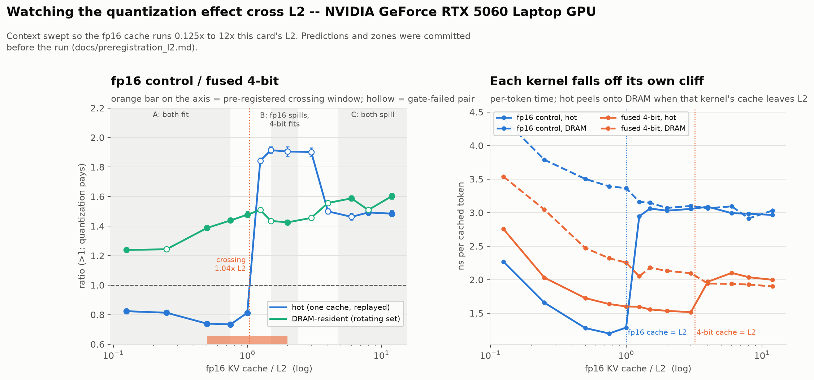

# Fused Triton kernel for quantized-KV decode attention

A Triton kernel that computes one decode step of attention **directly on a packed
2/4-bit KV cache**, without ever materializing a full-precision copy of the
history.

**Status: the kernel is correct, well tested, and slower than an unquantized
kernel of the same shape whenever the KV cache fits in L2.** That is the result,
and it is not the one I set out to find. Every timing below is clock-verified on a
laptop GPU whose clock range is wider than the effects being measured — see
[Results](#results) and [Limitations](#limitations). No number here should be
quoted without the condition attached to it.

- [The problem](#the-problem)
- [Results](#results) — the conditional, and the L2 crossing that explains it
- [How the numbers are verified](#how-the-numbers-are-verified) — summary; the full
  record is in [`docs/measurement.md`](docs/measurement.md)
- [Limitations](#limitations)
- [Reproducing](#reproducing) · [Layout](#layout)

---

## The problem

A naive quantized KV cache does this on every decode step:

```python
K_fp16 = dequantize(K_packed)     # writes S x D fp16 to DRAM
V_fp16 = dequantize(V_packed)     # writes S x D fp16 to DRAM
out    = attention(q, K_fp16, V_fp16)   # reads them straight back
```

Decode attention is memory-bound — one query row against the whole history — so
that round trip through DRAM is close to *all* of the cost. Per cached element-row
the naive path moves `0.5·D` (read packed) + `2·D` (write fp16) + `2·D` (read it
back) = **4.5·D bytes**, where a fused kernel moves **0.5·D**.

Why it is non-trivial: to feed `tl.dot` the kernel needs a dense `(BLOCK_N, D)`
tile of dequantized K, but a load of packed codes gives `(BLOCK_N, D/P)` bytes, and
Triton cannot slice-assign into a tile. The two obvious ways out — a `tl.join` +
`tl.reshape`, or `P` unrolled accumulators — cost a shared-memory layout conversion
or depend on fragile constexpr unrolling.

**The way around it** is to not reconstruct the tile at all, but *address* it.
Codes are packed "split-P", so byte `j` holds dims `j, j+DP, j+2·DP, …`. The kernel
builds an index vector over the full head dim and loads byte `d % DP` with shift
`(d // DP)·nbits`. Each byte is loaded `P` times, but those loads hit the same
cache line, so DRAM traffic is unchanged and the result is a dense `(BLOCK_N, D)`
tile with no reshape, no transpose, and no unrolled accumulators.

The kernel is flash-decoding shaped: the history is split across programs, each
computing a partial online-softmax result, reduced by a second tiny kernel. One
program owns one KV head and *all* the query heads sharing it, so the unpack is
paid once per GQA group rather than once per query head.

---

## Results

Measured on the machine described under [Reproducing](#reproducing). Shapes are
Qwen2.5-1.5B-Instruct's attention (`HQ=12, HKV=2, D=128`, GQA group 6), batch 1,
one attention layer, `group_size=32`.

### The honest headline

The fused kernel beats PyTorch's fp16 SDPA by 9.5–38×. **That number is misleading
and should not be used.** It changes two things at once: the cache is 4-bit *and*
the work is split across the history. PyTorch's SDPA does no split for
`q_len == 1`, so a fused-vs-SDPA comparison silently credits the quantization for a
parallelization win.

`kernels/fp16_decode_attn.py` exists to separate them. It is the same kernel — same
split, same online softmax, same GQA amortization, same combine kernel — reading
plain fp16. The only difference is the dequantization.


**Splitting the history is worth 10.5–26×. The quantization is worth 0.73–1.48×**,
and which side of 1.0 it lands on depends on whether the cache fits in L2.

**Hot regime (cache fits in L2), µs per decode step, CUDA-graph replay:**

| ctx | SDPA fp16 | Triton fp16 (control) | fused 4-bit | fused 2-bit | flash-decode effect | quantization effect |
|---|---|---|---|---|---|---|
| 512 | 46.4 | 3.3 | 4.6~ | 5.9~ | 14.0× | 0.73× |
| 2048 | 174.9 | 6.7~ | 8.2~ | 7.9~ | 26.2× | 0.81× |
| 8192 | 734.7 | 13.5 | 17.1 | 16.8 | 54.3× | **0.79×** |
| 16384 | 1456.9 | 21.3 | 29.2 | 29.3 | 68.4× | **0.73×** |

**Quantization makes the kernel 1.23–1.37× slower here, not faster.** Nearly the
whole apparent win is the split.

**Cold regime (rotating working set, 3× L2 = 101 MB), µs per decode step:**

| ctx | SDPA fp16 | Triton fp16 (control) | fused 4-bit | fused 2-bit | flash-decode effect | quantization effect |
|---|---|---|---|---|---|---|
| 512 | 49.0 | 4.6 | 5.1~ | 6.4~ | 10.5× | 0.90× |
| 2048 | 179.6 | 11.8~ | 9.7~ | 9.3~ | 15.3× | 1.21× |
| 8192 | 735.6 | 32.8 | 22.2 | 20.7 | 22.4× | **1.48×** |
| 16384 | 1464.1 | 55.6 | 38.6 | 35.8 | 26.3× | **1.44×** |

`~` = failed the *per-sample dispersion* half of the gate, but pins its median at
least as well as the worst row the gate accepts (`dispersion_tier.py`), and is
quoted only for effects at least 5× that pin. `*` would mean not usable at all;
there are none in these two tables. The distinction matters: every `~` row here is
pinned to ±0.20–1.04% against quantization effects of 10–27%.

The sign flips: once the cache genuinely comes from DRAM, 4-bit leads — but by
**1.21–1.48×, not by an order of magnitude**.

**At ctx = 8192 the sign flip is fully clock-verified in all three runs**, with
SDPA, the fp16 control and the fused kernel passing the gate at the same context
every time: **0.79–0.81× L2-resident, 1.469–1.478× DRAM-resident** (the ranges are
across the three runs, not a within-run CI).

Measured over **nine** full-method runs spanning three protocols, all three rows of
the attribution chain survive at each context:

| ctx | gate alone | gate + pinned tier |
|---|---|---|
| 512 | 5/9 | **9/9** |
| 2048 | 5/9 | **9/9** |
| 8192 | 7/9 | 7/9 |
| 16384 | 2/9 | **7/9** |

The bar for the second tier is not a chosen number — it is the worst-pinned row the
gate already accepts (±1.70% on run 3), so it cannot admit anything less certain
than a row this README already prints unstarred. ctx=8192 does not move, because
its one incomplete run fails on a median genuinely pinned to only ±1.91%.

Two things this does **not** fix: promotion is a property of the run, exactly as
quotability is — no row is promoted in all six runs — and the ranges above are
still the run-to-run ones, which are a median 2.4× wider than any single run's CI.


**So the real claim is conditional: the fused kernel pays for itself only when the
KV cache does not fit in L2, and costs 1.23–1.37× when it does.** At 512 tokens
quantization loses in *both* regimes — there is not enough history to amortize
anything.

### Watching it cross L2 (pre-registered, 2026-09-10)

The tables above never actually show the mechanism they are conditional on: every
context in them has an fp16 cache (0.5–16.8 MB) that fits in this card's 33.6 MB
L2, so the "hot" control was never measured outside L2. `l2_sweep.py` moves the
working set across L2 instead, sweeping context until the fp16 cache is 0.125× to
12× **this card's own L2** (ctx 4096 → 393216). Five predictions and their decision
rules were committed before the run
([`docs/preregistration_l2.md`](docs/preregistration_l2.md), commit `7aefc6f`).



| fp16 cache / L2 | 0.125 | 0.5 | 0.75 | **1.0** | **1.25** | 1.5 | 2 | 3 | 4 | 8 | 12 |
|---|---|---|---|---|---|---|---|---|---|---|---|
| quant, hot | 0.82 | 0.74 | 0.74 | **0.81** | **1.84~** | 1.91* | 1.91* | 1.90* | 1.50* | 1.49 | 1.48 |
| quant, DRAM | 1.24 | 1.39 | 1.44 | 1.48 | 1.51~ | 1.44~ | 1.43 | 1.46~ | 1.56~ | 1.51~ | 1.60 |

`~` and `*` as in the tables above, with the tier bar read off the sweep itself
(±1.07%, the worst-pinned measurement the gate accepted in this run).

**All five predictions hold.** The hot ratio crosses 1 at **1.04× L2** (the
written-down guess was 1.0). Between 1.5× and 3× L2 the fp16 cache has spilled and
the 4-bit cache has not, a regime `benchmark.py` never produces on this card. There
quantization pays **1.9×**, more than it ever does from DRAM. Past ~4× both caches
spill and the hot ratio falls back onto the DRAM one. The right panel shows the
mechanism directly: each kernel's hot curve drops onto its DRAM curve when *its
own* cache passes L2, and the two cliffs sit 3.2× apart, the ratio of the two cache
sizes.

Two qualifiers belong next to that, and the outcome section of the pre-registration
has three more. First, the hump rests on the fp16 control's hot timings, which fail
the dispersion gate there (IQR 6–11%; median pinned to ±1.1–2.7% against a +90%
effect). The crossing and zone A survive every filter; the hump survives the
committed scoring and tier 2 only in part. Second, the sweep's DRAM ratios run ~7%
low: it tunes on the hot regime, and that config is measurably slower from DRAM.

This is one card. The same script is the cross-GPU test: its grid is relative to
L2, so on another card the crossing should sit near 1× L2 again, which is a
different context length on every card with a different L2.

### The inner loop was mostly loading the same 4 numbers over and over

The per-group scale and zero are `(BLOCK_N, head_dim/group_size)` in memory — 4
values per token at `group_size=32`. The kernel used to load them as
`(BLOCK_N, head_dim)` by indexing with `d // group_size`, **re-reading each
parameter 32 times**, four times per loop iteration (K and V, scale and zero).
Loading them at their real width and expanding in registers is bitwise identical —
asserted over 40 cases of (S × nbits × group_size), not merely close:

| | instructions | registers | spills |
|---|---|---|---|
| gather (`d // group_size`) | 2245 | 244 | 0 |
| broadcast | **1653** | **128** | 0 |

Worth 1.16–1.48× L2-resident and 1.05–1.32× DRAM-resident, biggest where the kernel
is issue-bound rather than bandwidth-bound. The old path is kept as a permanent
benchmark row (`fused_gather_meta_*`) so the attribution stays auditable.

**This refutes a claim I used to make on this page.** It said: *"Group size barely
moves it (25.4 / 25.6 / 26.6 µs at gs = 16/32/64), so the scale+zero tile loads are
not the cost."* The measurement was right and the inference was wrong. In the
gather path the load is indexed by `d // group_size` over the **full** head dim, so
it issues `BLOCK_N × head_dim` loads *whatever the group size is* — group size
changes how many distinct values are read, never how many instructions are issued.
The experiment varied metadata **bytes** and concluded about metadata
**instructions**, and a flat sweep is exactly what the expensive version predicts.

### …and then the same experiment, run properly, refuted half of *that*

`sweep_group_size.py` re-runs the sweep on **both** paths at once, with the
prediction written down first: broadcast should now be sloped, because there
`group_size` really does set the load count; gather should stay flat. Gather was
flat. Broadcast was **also nearly flat** — 1.07–1.17× across an 8× range of
metadata loads. The prediction was wrong, and the right shape is *saturation*
(L2-resident, ctx = 8192, all rows clock-verified):

| path | metadata loads per tile | median |
|---|---|---|
| gather, gs=32 | 4096 | 22.0 µs |
| broadcast, gs=16 | 256 | 17.0 µs — 16× fewer loads buys **1.29×** |
| broadcast, gs=128 | 32 | 15.9 µs — a further 8× buys **1.07×** |

So metadata loads are a real cost and they stop being the *binding* cost about an
order of magnitude below where the gather path sat. The broadcast change was worth
1.29× because it crossed that point, not because load count and time are
proportional. A version of this project that had only run the second half of that
table would have concluded metadata loads were free — which is exactly the mistake
the first sweep made, from the other side.

The sweep also left a 93 µs outlier at `gs=128` on the gather path, which turned
out to be a Triton shared-memory layout conversion triggered by a degenerate index.
It affects the control only, and the details are in
[`docs/measurement.md`](docs/measurement.md#appendix-the-gs128-outlier-was-a-shared-memory-layout-conversion).

### Two variants I measured and rejected

These bound the claims above, which is why they are here rather than deleted:

- **Folding the zero-point out of the inner loop** (`scale·(q·code) + zero·Σq`, a
  per-group dot against the raw codes). Not faster at any context in either regime:
  0.72–1.08× at 4-bit, 0.67–0.94× at 2-bit. The only cell above the 1.05× bar
  (4-bit, DRAM-resident, ctx=8192) sits on a row that failed the clock/dispersion
  gate, and the audit says so instead of quoting it. Kept as an option
  (`fold_zp=True`) only because it is *more accurate* — it never rounds a
  dequantized K value to fp16, so kernel error stays flat at 1.5e-4 instead of
  drifting 2.3e-4 → 7.7e-4 as context grows.
- **The same narrow-load trick applied to the packed codes.** Bitwise identical and
  a **loss** (0.69–0.96× at ctx ≥ 8192); registers go 128 → 223. The codes are
  needed at full width regardless, so expanding them from a narrow load adds a live
  tile without removing one. Reverted. The lesson generalizes less than it first
  looks: the win is specific to loads whose expanded form is redundant.

### Memory

Exact, not measured — these follow from the format.

| format | effective bits/element | cache @ ctx=512 (1 layer) | vs fp16 |
|---|---|---|---|
| fp16 | 16.0 | 0.52 MB | 1.0× |
| 4-bit, gs=32 | **5.0** | 0.16 MB | **3.2×** |
| 2-bit, gs=32 | **3.0** | 0.10 MB | **5.3×** |

4-bit with an fp16 scale and zero per 32 elements is **5.0** bits/element, not 4.
Every memory claim here quotes the effective number, so the compression is 3.2×,
not 4×.


This is the one unconditional win: at 16k tokens the whole-model KV cache is 470 MB
in fp16, 147 MB at 4-bit, 88 MB at 2-bit. The fused kernel also allocates nothing
to get there — 0.3 MB of transient workspace at 16k, against 117 MB for
dequantize-then-SDPA, which has to materialize the fp16 cache.

### Correctness

`python -m pytest test_correctness.py -q` → **146 passed in ~2 min**.

Two different errors are measured, and the distinction is the whole point:

- **Kernel error** — fused kernel vs. dequantize-then-attend in fp32 on the *same*
  dequantized values. Any difference is the kernel's own arithmetic.
- **End-to-end error** — vs. attention on the unquantized fp16 cache. This is
  dominated by the quantizer, not the kernel.

| ctx | bits | cosine (kernel vs dequant ref) | rel L2 | kernel vs fp16 truth | baseline vs fp16 truth |
|---|---|---|---|---|---|
| 512 | 4 | ≥ 0.9999999 | ≤ 4.18e-04 | 1.207e-01 | 1.208e-01 |
| 2048 | 4 | ≥ 0.9999999 | ≤ 4.75e-04 | 1.396e-01 | 1.397e-01 |
| 8192 | 4 | ≥ 0.9999988 | ≤ 1.59e-03 | 1.251e-01 | 1.249e-01 |
| 16384 | 4 | ≥ 0.9999992 | ≤ 1.28e-03 | 1.509e-01 | 1.514e-01 |
| 512 | 2 | ≥ 0.9999998 | ≤ 5.98e-04 | 6.558e-01 | 6.560e-01 |
| 2048 | 2 | ≥ 0.9999996 | ≤ 8.71e-04 | 8.110e-01 | 8.105e-01 |
| 8192 | 2 | ≥ 0.9999996 | ≤ 8.44e-04 | 6.589e-01 | 6.585e-01 |
| 16384 | 2 | ≥ 0.9999995 | ≤ 9.01e-04 | 7.560e-01 | 7.557e-01 |

Thresholds are asserted, not eyeballed: `cosine ≥ 0.99999`, `rel L2 ≤ 5e-3`, and
the kernel's end-to-end error must be within 1.5× of the PyTorch baseline's. The
suite also covers pack/unpack roundtrip exactness, a half-quantization-step
reconstruction bound, GQA and MHA shapes, group sizes 16–128, block sizes 16–128,
split counts 1/2/5/17/64 (uneven on purpose), S=1, extreme scores, and a
worst-single-element check that aggregate cosine would hide.


Test inputs inject 1% heavy-tailed outliers at 8× magnitude, because pure Gaussian
noise is an unrealistically easy input for a quantizer and would flatter these
numbers.

---

## How the numbers are verified

An earlier version of this project reported the DRAM-resident regime as an
**11–15×** win for quantization. It was wrong by an order of magnitude, and the
reason was the instrument, not the kernel: on an 80 W laptop part that idles at
285 MHz and boosts to 3090 MHz, the fp16 control is fast enough that its
measurement finished before the GPU had left idle clocks. So the control looked
~12× slower than it is.

Everything below is the short version. The full record — every apparatus bug, every
fix, and the several plausible fixes that turned out to be wrong — is in
**[`docs/measurement.md`](docs/measurement.md)**.

**The clock gate.** `benchmark.py` samples clocks in the background, spins the GPU
up before every measurement, and attributes samples to the sampling loop only. A
row is quotable only if every clock sample was ≥ 70% of maximum, its timing IQR was
≤ 5% of its median, and its clock window holds ≥ 4 samples. Last full run: **39 of
48 rows quotable**, and every rejection is dispersion — there are no clock
rejections left.

**A third verdict, not a wider gate.** `dispersion_tier.py` separates rejected rows
that still pin their medians tightly from rows that genuinely do not. The bar is
read off the instrument — the worst-pinned row the gate itself accepts (±1.70%) —
so the tier cannot admit a number less certain than one already quoted. Run 3:
**39 quotable / 7 pinned / 2 rejected** of 48. Pinned rows are marked `~`, never
starred, and only for effects at least 5× their own pin.

**The adversarial audit.** `audit_claims.py` writes down every claim this project
could make and attacks it, judging speedups by a block-bootstrap 95% CI against a
1.05× practical-significance bar. Current run: **72 claims — 26 TRUE / 22 TRUE BUT
CONDITIONAL / 12 MISLEADING / 12 FALSE.** Historically the `FALSE` verdicts have
been my own claims about the L2-resident regime.

**One run's CI is not the uncertainty on the number.** Three independent full runs
put the honest interval at about **2.4× the one the audit prints**. No verdict
changed between runs, on any of the 60 tracked ratios.

**The measurement protocol is itself a variable.** Four protocols, three runs each,
pre-registered: what moves the numbers is *recent memory-system saturation*, not run
length. A row's achieved bandwidth predicts how much a protocol change moves it
(r = +0.84), which makes the fp16 control — the same algorithm reading 4× the bytes
— the most protocol-sensitive row in the benchmark. The shipped protocol reports the
most favourable of the four: **the honest range for `quant_cold@8192` across
everything measured is 1.28–1.48**, not 1.469–1.478, with three of four protocols
centred near 1.40.

---

## Scope and caveats

Four things worth knowing before quoting any number above.

- **2-bit is not usable**, despite passing every test. The kernel reproduces the
  dequantized values to cosine ≥ 0.9999996, but the *quantizer* loses far too
  much: rel L2 of **0.66–0.81** against the fp16 cache, versus 0.12–0.14 for
  4-bit. 2-bit is a correct implementation of a scheme that does not preserve the
  cache. 4-bit is the only configuration worth using.
- **FlashAttention is not in the comparison.** This Windows torch build reports
  "not compiled with flash attention", so the strongest fp16 baseline available
  was cuDNN. On Linux with FA2 the SDPA baseline would be stronger and the
  flash-decode effect smaller.
- **One attention layer, batch 1.** There is no tokens/sec claim here, and none
  should be inferred from these numbers.
- **One GPU, one clock regime, one driver.** The gate makes these numbers
  reproducible *on this machine*; it says nothing about how the attribution shifts
  on a part with a bigger L2 or a fixed power budget. That is why the conditional
  is stated in terms of L2 residency, and why the cross-GPU predictions are
  already committed (`docs/preregistration_l2.md`, Part B) and scored by
  `cross_gpu.py`.

---

## Reproducing

> **Running this on a different GPU?** See
> [`docs/RUN_ON_YOUR_GPU.md`](docs/RUN_ON_YOUR_GPU.md) — a complete standalone
> guide written for someone who has never seen this project, with install steps,
> troubleshooting, and exactly what to send back. The single most valuable
> contribution anyone can make here is one run on a card with a different L2,
> because that is the axis the central conditional is stated in terms of and the one
> thing a single machine cannot test.

**Hardware actually used:** NVIDIA GeForce RTX 5060 Laptop GPU (Blackwell, sm_120,
26 SMs, 8 GB, 34 MB L2), Windows 11, driver 610.47. This is a thermally-limited
80 W laptop part sharing the GPU with the desktop compositor, idling at 285 MHz and
boosting to 3090 MHz — which is exactly why every timing is gated on clock
verification. `nvidia-smi -lgc` would pin the clocks outright but needs
administrator rights; the benchmark spins the GPU up instead and rejects any row it
could not verify.

**Stack:** `torch 2.12.0+cu130`, `triton-windows 3.8.0.post28`, CUDA 13.0,
`transformers 5.16.1`. Full pins in `requirements.txt`.

```bash
python -m venv .venv
.venv/Scripts/python.exe -m pip install torch==2.12.0 --index-url https://download.pytorch.org/whl/cu130
.venv/Scripts/python.exe -m pip install -r requirements.txt

.venv/Scripts/python.exe -m pytest test_correctness.py -q   # 146 tests, ~2 min (GPU)
.venv/Scripts/python.exe -m pytest test_between_run.py test_l2_sweep.py test_cross_gpu.py -q  # 179 tests, ~30 s (no GPU)
.venv/Scripts/python.exe benchmark.py --quick                # ~75 s smoke run
.venv/Scripts/python.exe benchmark.py --samples 50           # full suite, ~13 min
.venv/Scripts/python.exe -u l2_sweep.py                      # the L2 crossing, ~11 min
.venv/Scripts/python.exe cross_gpu.py --card me=results/benchmark.json --sweep me=results/l2_sweep.json
.venv/Scripts/python.exe dispersion_tier.py                  # three-tier verdict per row
.venv/Scripts/python.exe bandwidth_law.py                    # needs compare_protocols.json
.venv/Scripts/python.exe audit_claims.py                     # reads results/benchmark.json
.venv/Scripts/python.exe make_plots.py                       # regenerates docs/plots/
.venv/Scripts/python.exe make_session_plots.py               # the process figures
```

**Do not run anything CPU-heavy while a benchmark is timing.** Numpy bootstraps,
`pytest` and the analysis scripts alongside a run are enough to produce a memory
P-state excursion in the results.

To get an interval that covers more than one run's sampling noise, run the benchmark
two or three times into separate files and compare them. The audit picks the result
up automatically and reports it next to every CI:

```bash
for i in 1 2 3; do
  .venv/Scripts/python.exe -u benchmark.py --samples 50 --out results/runs/run$i.json
done
.venv/Scripts/python.exe between_run.py results/runs/run*.json   # ~40 min total
.venv/Scripts/python.exe audit_claims.py
```

The protocol itself is a variable, so the interval that matters spans protocols
rather than repetitions. Three runs of each of the four (~2.5 h of wall clock), then
the comparison:

```bash
.venv/Scripts/python.exe -u benchmark.py --samples 50 --preload 300 \
    --out results/tail/fullpre1.json    # --methods attribution for the short ones
.venv/Scripts/python.exe compare_protocols.py \
    --label full=results/runs/run{1,2,3}.json \
    --label subset=results/tail/{validate,sub2,sub3}.json \
    --label preloaded=results/tail/pre{1,2,3}.json \
    --label fullpre=results/tail/fullpre{3,4,5}.json
```

`--methods attribution` cuts a run to 210 s by timing only the three rows the
conditional is built from. It is **not** a substitute for a full run — it is
measurably shifted and four times more excursion-prone — but it is a good way to
provoke the P-state excursion deliberately:

```bash
.venv/Scripts/python.exe benchmark.py --samples 50 --methods attribution --out results/tail/sub1.json
.venv/Scripts/python.exe clock_excursions.py \
    --label full=results/runs/run1.json,results/runs/run2.json,results/runs/run3.json \
    --label subset=results/tail/sub1.json,results/tail/sub2.json,results/tail/sub3.json
```

On Windows, Triton needs an MSVC toolchain (Visual Studio 2022, MSVC 14.4x). On
Linux, swap `triton-windows` for `triton==3.8.0`.

`results/` is gitignored — benchmark output is meant to be regenerated, not
committed.

---

## Layout

| file | what it is |
|---|---|
| `quantize.py` | group-wise 2/4-bit asymmetric quantization, split-P packing. Pure PyTorch, the correctness ground truth. |
| `reference.py` | fp32 ground truth + the baselines. Probes six fp16 attention strategies per shape and caches the fastest, so the baseline is not a strawman. |
| `kernels/fused_decode_attn.py` | the fused kernel. |
| `kernels/fp16_decode_attn.py` | the control: identical shape, unquantized. Isolates the flash-decoding effect. |
| `test_correctness.py` | 146 tests on the kernel, explicit asserted thresholds — including two bitwise-identity suites (metadata broadcast, fp16 dequant) that assert equality rather than a tolerance. |
| `test_between_run.py` | 139 CPU-only tests on the between-run, excursion, protocol, dispersion-tier and bandwidth-law machinery — including the 2x2 arithmetic, the design reader and the tier's calibration bar — against synthetic runs with known answers. |
| `benchmark.py` | timing + memory. Rotating working set for the cold regime, CUDA-graph replay for the hot one. Records the driver, bus width and a DRAM bandwidth probe (run after timing), and nothing that identifies the machine's owner. |
| `l2_sweep.py` | the direct test of the L2 mechanism: context swept so the fp16 cache runs 0.125–12× the card's own L2, scored against predictions committed in `docs/preregistration_l2.md`. `test_l2_sweep.py` (28 CPU tests) checks that the scoring can fail. |
| `cross_gpu.py` | scores the cross-GPU predictions (C1–C4, M1) over volunteers' files, with the pre-registered exclusions. Written before any volunteer data existed. `test_cross_gpu.py`, 12 CPU tests. |
| `audit_claims.py` | adversarial self-audit: bootstrap CIs over raw timings, attribution against the fp16 control, per-optimization claims with their own controls, and a clock-verification gate. |
| `between_run.py` | what a bootstrap CI does not cover: compares N independent full runs, reports the run-to-run interval, the inflation over the single-run CI, and whether any verdict moved. |
| `clock_excursions.py` | the rate at which a row drops a memory P-state, split by run protocol and regime, with the gate's verdict on each — and whether the row's own duration predicts it, decomposed within method as well as pooled. |
| `compare_protocols.py` | whether two measurement protocols produce the same numbers at all, the bandwidth law that says which rows they will disagree on, and the 2x2 that separates run length from recent saturation. |
| `bandwidth_law.py` | whether "achieved bandwidth predicts protocol sensitivity" is a law or a method label: the within-method decomposition, leave-one-out, per-row residuals, and whether the memory clock really is constant across protocols. |
| `clock_ramp.py` | the memory clock's time constant, measured directly: idle the GPU, load it, and watch. Answers in minutes what repeating protocols could not settle in hundreds of runs. |
| `configs.py` | the model's attention shape, taken from published architecture parameters and verified against the HuggingFace config when `transformers` is installed — the benchmark records whether that verification actually happened. |
| `thermal_check.py` | whether temperature is even large enough to move a memory P-state: the within-cell slope in MHz per degree, against the degrees the protocols actually span. |
| `analyze_dispersion.py` | decomposes every rejected measurement into trend, tail and floor, so the gate is argued with rather than tuned. |
| `dispersion_tier.py` | the third verdict: which gate-failed rows pin their medians well enough to be used anyway, judged against the worst row the gate already accepts. Post-hoc, so it never touches the instrument. |
| `sweep_group_size.py`, `probe_gs128.py` | the metadata-load sweep and the static PTX probe behind the gs=128 cliff. |
| `make_plots.py` | the figures in `docs/plots/`, regenerated from `results/benchmark.json`. |
| `make_session_plots.py` | the argument figures about the project's own measurement process. |
| `docs/measurement.md` | how every number here was verified: the clock gate, the dispersion tier, the between-run and cross-protocol work, and the apparatus bugs behind each. |
| `docs/preregistration_l2.md` | the L2 predictions and decision rules, committed before the sweep ran. |
| `docs/progress_log.md` | what was tried and what broke, written as it happened. |
