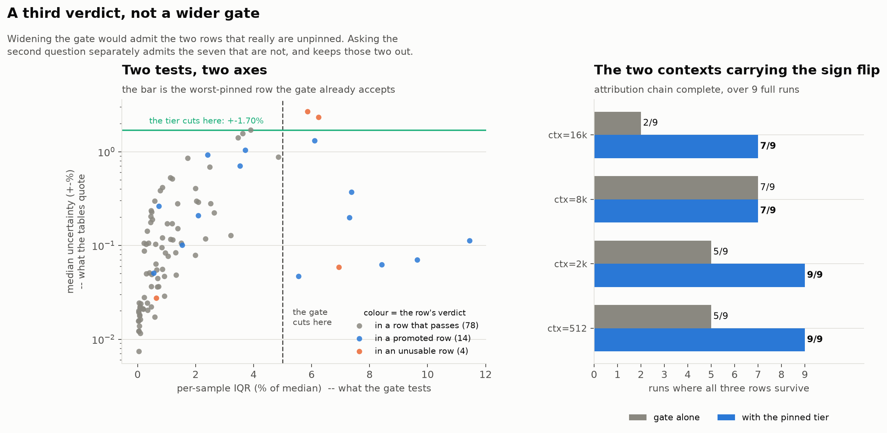
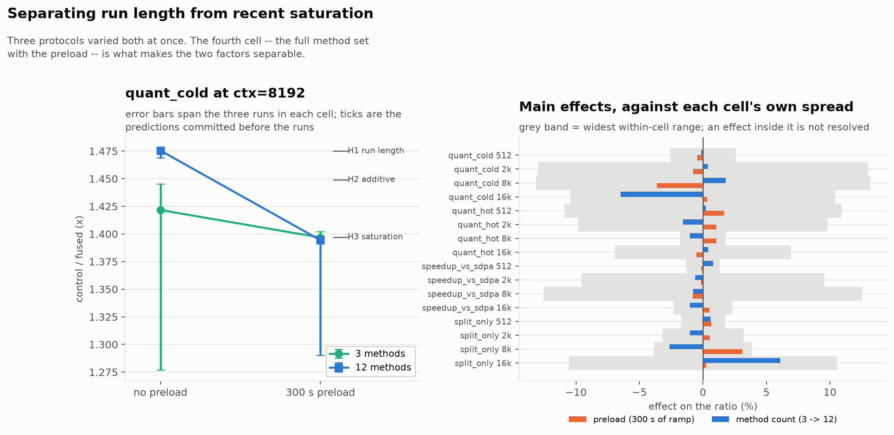
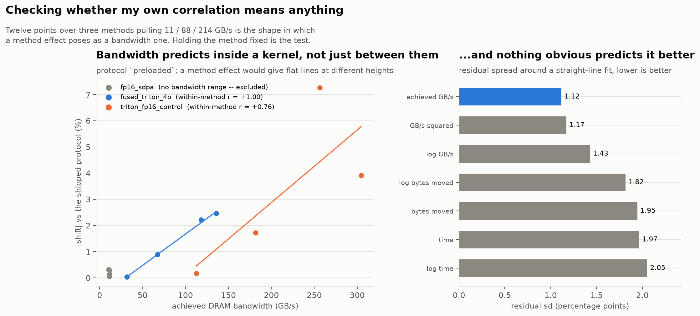

# How I verified the numbers

Every timing in the [README](../README.md) is gated, and the gate exists because
the first version of this project published a result that was wrong by an order
of magnitude. This document is the full record of the instrument: what it
measures, the bugs I found in it, and the things I tried that did not work.

The short version is that on an 80 W laptop GPU the apparatus is where the errors
live. Not the kernel — the kernel has been correct since early on. Almost
everything I got wrong here, I got wrong about the measurement.

---

## 1. The clock gate

An earlier version of this project reported the DRAM-resident regime as an
**11–15×** win for quantization. That was wrong, and the way it was wrong is
worth stating plainly.

This is an 80 W laptop GPU that idles at 285 MHz and boosts to 3090 MHz — a 9×
range, larger than most of the effects I am trying to measure. The fp16 control
kernel is fast enough that its measurement finished while the GPU was still at
idle clocks, so the control looked ~12× slower than it is and the quantization
looked ~12× better than it is. Nothing in the old benchmark could see this,
because it never asked what the clocks were doing.

`benchmark.py` now runs a background `nvidia-smi` sampler, deliberately spins the
GPU up to ≥ 80% of maximum before *every* measurement, and attributes the clock
samples to the sampling loop only — warmup and CUDA-graph capture are excluded,
so they neither look like throttling nor hide it. A row is **quotable** only if

1. every clock sample during its sampling loop was ≥ 70% of the 3090 MHz maximum,
2. the timing's own IQR was ≤ 5% of its median, and
3. its clock window holds at least 4 samples.

The last full run: **39 of 48 rows quotable**. The rejects are named in
`results/benchmark.json` under `clock_monitoring.rejected_rows`. Every one of
them is dispersion — there are no clock rejections left.

## 2. The gate had a second failure mode underneath the first one

Adding the clock monitor caught throttling. It did not catch *not having looked
long enough to tell*, and a gate that answers "the GPU was boosted" from one
sample reads exactly like one that answers from twenty.

Two things were wrong, and fixing the first exposed the second:

- **The ramp was being spent before the measurement began.** `warm_clocks()` ran
  in the driver, but the timing function then did warmup, CUDA-graph capture and
  priming replays before opening its clock window — a long CPU-bound stretch with
  the GPU near idle. A slow PyTorch baseline re-boosts inside its own first
  sample; a 14 µs kernel never does, so **the gate was penalising methods for
  being fast**, which is the opposite of the failure it was built to catch. The
  ramp now runs *inside* the timing function, after capture.
- **28 of 96 measurement windows were being judged on a single `nvidia-smi`
  sample** — including rows the attribution rests on. `nvidia-smi -lms 100`
  actually delivers ~9 Hz (109 ms median gap, measured), so a 30 ms measurement
  cannot earn evidence about clocks at all. Windows are now held open ≥ 1.5 s and
  must carry ≥ 4 samples, reported as its own failure mode rather than passing
  silently. Windows with ≤ 1 sample: **28 → 0**; the minimum is now 13.

An earlier attempt bounded that stretch by *sample count* rather than time, which
silently bound first for exactly the fast kernels that needed it — their samples
are cheap, so 600 of them is 0.26 s. The unit mattered.

## 3. The warm-up was warming the wrong half of the machine

`triton_fp16_control` — the *fastest* method, and the one the whole attribution
rests on — kept failing at long context. Its DRAM-resident timings fall **19.3%
and 22.6% across a single measurement window** at ctx 8192 and 16384. That is not
jitter.

It was not the SM clock; those windows pass that gate (SM min 2445–2490 MHz
against a 2472 MHz floor). It was the **memory** clock. The P-states here are
405 MHz at deep idle, **12001 MHz at light idle**, and **9001 or 11001 MHz under
load** — an 80 W part shares power between the domains, so the memory clock comes
*down* when the SMs start working and then moves between those two states, a 20%
swing. The DRAM-resident measurements are bandwidth-bound, so a window spanning
that is two measurements averaged together.

| DRAM-resident windows | n | median trend | median IQR | fail IQR ≤ 5% |
|---|---|---|---|---|
| memory clock changed | 22 | **−5.6%** | 3.8% | **9** |
| memory clock held | 26 | −0.9% | 1.7% | 1 |

**The cause.** The pre-measurement ramp was a 2048×2048 fp16 GEMM: compute-bound,
working out of cache. It drives the SM clock hard and asks the memory system for
almost nothing, so the governor had no reason to move the memory clock until the
*measurement* started touching DRAM. Every ramp in this project had been warming
the half of the machine that was already fine. It now runs a DRAM-sized copy
alongside the GEMM, waits for the memory clock to stop changing rather than for
the SM clock to cross a line, and learns the reachable ceiling from samples taken
while the GPU is *busy* — the idle 12001 MHz is a clock no measurement will ever
run at, and targeting it made the stopping condition unreachable.

**The obvious companion change was measured and rejected.** Putting memory-clock
stability into the gate, the way SM stability already is, rejects *every*
DRAM-resident row — rows whose timing IQRs are 0.4–2%. And the evidence points
the opposite way from the intuition; comparing the same 48 measurements before and
after the ramp fix:

| | median \|trend\| | median IQR | IQR > 5% | memory-clock spread |
|---|---|---|---|---|
| L2-resident, old ramp | 2.4% | 1.6% | 5/24 | mostly 0% |
| L2-resident, new ramp | **0.2%** | **0.7%** | **3/24** | ~19% |
| DRAM-resident, old ramp | 2.0% | 1.8% | 5/24 | 0% or ~21% |
| DRAM-resident, new ramp | 1.9% | 1.8% | **2/24** | ~19% |

The ramp that made the measurements better made the memory clock move *more*, so
a gate on memory-clock movement would have discarded exactly the measurements the
fix improved. The memory clock was a **ramp** problem wearing the costume of a
gate problem: warm the memory system first and the drift loses its direction, and
what remains is oscillation both methods sit in equally — noise in a ratio, not
bias.

## 4. What the dispersion gate actually measures

After the ramp fix, 9 of 48 rows fail the `IQR ≤ 5% of median` half of the gate.
It was 23 before, and the analysis below is what those 23 looked like.
`analyze_dispersion.py` decomposes all 96 measurements to find out whether either
of the two obvious fixes — shorter windows, or longer ones — would work. Mostly
they would not: only **8 of 25** failures carry a significant trend, and **13 of
25** have neither a trend nor an outlier tail, which is the card's own wander and
no window length changes it.

Meanwhile the failing rows pin their medians to **±0.69%** (median; worst ±3.36%)
against ±0.16% for passing rows, while the effects reported here are 10–50%. So a
starred row means *the card was restless*, not *the number is unknown*.

**The gate is unchanged.** Loosening a gate because it is inconvenient is how the
numbers this project exists to avoid get published. What changed is that the audit
states this against itself, as `method.dispersion_gate` — and that there is now a
third verdict instead of a wider gate.

### A third verdict, not a wider gate

`dispersion_tier.py` splits the rejects in two. A row joins the **pinned** tier if
it failed the per-sample IQR gate but pins every regime's median at least as well
as *the worst row the gate itself accepts* — ±1.70% on run 3, from
`fused_gather_meta_4b@512`, a row the README prints unstarred. The bar is read off
the instrument per run rather than chosen, so the tier cannot admit a number less
certain than one already quoted, and across nine full runs it lands at 1.43–1.96%.
Run 3: **39 quotable / 7 pinned / 2 rejected** of 48.

The two that stay rejected are pinned to ±2.33% and ±2.68% — which is exactly why
`MAX_IQR_FRAC` was not widened instead. Widening admits those two along with the
seven that deserve it; the median-precision test separates them.

The two lines in the left panel are perpendicular, and that is the whole argument:
the gate cuts on the x axis, and every number the tables quote lives on the y
axis.

Two restrictions keep it a report rather than a loophole. A **clock-rejected row
is never promoted** — the gate is not a P-state filter, so that failure is
invisible here. And promotion is **per claim**: a pinned row carries a floor of 5×
its own median uncertainty, and the audit marks it `~` rather than starring it,
against the effect it is actually being asked to support. No promoted row is
currently asked to support an effect below its floor — the guard is slack, which
is a statement about the claims and not about the guard.

## 5. The confidence intervals were too narrow

Every CI here was an i.i.d. bootstrap. `analyze_dispersion.py` measures lag-1
autocorrelation of up to **0.72** on these timing series — the card wanders rather
than jittering — so the samples are not independent and the i.i.d. interval is up
to **1.95× narrower** than the data supports. Since every verdict turns on whether
an interval clears a bar, too narrow is too confident, in the flattering
direction. The resample is now **circular-block**.

Two corrections landed inside that fix. *Moving* blocks under-weight the ends of a
series, which shifts an interval's centre rather than its width, and that alone
promoted one claim from `CONDITIONAL` to `TRUE`; circular blocks weight every
sample equally. That still did not settle it, because the claim was on a knife
edge — its CI low moved from 1.04973 to 1.05019 against a 1.05 bar. `_verdict` was
a step function evaluated at the threshold, so any rounding decision became a
verdict; it now requires the deciding endpoint to clear the bar by at least 10% of
the interval's own width.

With both in place, **no verdict changes.** The correlation correction moved
nothing; the apparent movement was the missing margin.

## 6. One run's CI is not the uncertainty on the number

Every interval in `audit.md` is a bootstrap over the samples of a single run, so
it answers *how much would this ratio move on another 50 samples from this
window*. It cannot answer *how much does it move if the process exits and the card
lands in a different memory P-state next time* — and I had one observation saying
the second number was the larger one: the DRAM-resident quantization ratio at
ctx=8192 once read **1.27×** where another run read **1.47×**, on CIs of ±0.01
each.

So I ran the benchmark three more times end to end, changed nothing between them,
and compared them with `between_run.py` (`results/between_run.md`).

| | n | median inflation | median between-run spread | worst spread |
|---|---|---|---|---|
| passed the gate in every run | 22 | **2.4×** | 0.7% | 2.0% |
| failed it in at least one | 38 | **5.0×** | 2.9% | 44.0% |

"Inflation" is how many times wider the union of the three runs' intervals is than
any one of them. So the honest interval on a quoted number is about **2.4× the one
the audit prints** — the CI is too narrow, but by a factor, not by an order of
magnitude.

**No verdict changed between runs**, on any of the 60 tracked ratios. The headline
conditional holds in all three: quantization costs 0.71–0.91× when the KV cache is
L2-resident at every context, and pays 1.18–1.20× at 2k, 1.46–1.48× at 8k and
1.41–1.47× at 16k when the working set exceeds L2.

Three things fell out of this that were not the question I was asking.

**The gate scores well out of sample.** It is applied *inside* a run and knows
nothing about the other two, yet the rows it rejects are the rows that move when
the benchmark is run again — 5.0× against 2.4× inflation, 2.9% against 0.7%
spread. That is independent evidence for leaving it where it is, on top of the
existing reason not to widen it.

**The P-state story is now measured rather than asserted.** Across the 48
DRAM-resident rows, the correlation between a row's between-run movement in time
and its between-run movement in mean memory clock is **r = +0.71**. The rows that
moved are the rows whose clock moved.

**The 1.27× was a one-off, not the typical spread.** `fused_triton_4b@8192` sat at
11001 MHz in all four subsequent runs; the 9934 MHz window that produced the 1.27×
has not recurred, and the three runs here agree to 0.6% at that cell. This is
worse news than it sounds, not better: the run-to-run distribution has a body of
about ±1% and a tail that moves a headline ratio by 15%, and **three runs
characterise the body and say nothing about the tail.** The intervals above are a
floor on the uncertainty, not a bound on it.

**Quotability is itself a random variable.** 35 of 48 rows pass the gate in every
run, 46 in at least one — so 11 rows are starred or not depending on the run. A
star means *this run was clean here*, not *this kernel is stable here*.

The audit carries all of this against itself. Every per-context claim prints its
run-to-run interval next to its CI, a claim whose verdict moved between runs is
downgraded automatically, and `method.between_run_spread` audits the audit's own
intervals — it reads `MISLEADING` when no between-run data exists at all, which is
the state every earlier version of this project was in.

## 7. The tail, and the shortcut that didn't survive contact with it

The section above ends on an admission: three runs bound the body of the
run-to-run distribution and say nothing about its tail. The 1.27× that started the
whole exercise never came back.

Putting a rate on a tail needs many runs, and a full run is 13 minutes — so
`benchmark.py --methods attribution` times only the three rows the conditional is
built from and skips the other nine. Filtering happens after the cases are built,
so every replica is still allocated and the GPU sits in the same memory state.
210 s against 775 s. The intent was a faster run of the same experiment.

**It is a different experiment, and validating it before using it is the only
reason that is known.** Three subset runs against the three full ones:

| ratio | ctx | full runs | subset runs |
|---|---|---|---|
| `quant_cold` | 8192 | 1.469–1.478 | **1.277–1.445** |
| `split_only` | 8192 | 22.585–23.046 | **23.299–23.710** |

Two of twelve ratios miss the full-run range entirely, and the spread at the
headline cell is 13% against 0.6%.

My first explanation was that no telemetry accounted for it. That was wrong, and
the way it was wrong is the usual way: the power figure I was comparing was a
*whole-run* average, which is flat by construction because the card sits at its
limit most of the time. Per row, `compare_protocols.py` finds the channel:

| row | time | power | SM clock | mem clock |
|---|---|---|---|---|
| `triton_fp16_control` @8k cold | **−3.9%** | **+3.1%** | +0.03% | identical |
| `triton_fp16_control` @16k cold | **+10.1%** | **−3.5%** | +0.13% | — |
| `fp16_sdpa` @512 L2 | **+1.1%** | **−6.2%** | +0.02% | — |

Across all 24 shared rows the correlation between a row's power shift and its time
shift is **r = −0.57**: more power, less time, *at the same reported clocks*. So
the clocks are not the whole instrument. On an 80 W part the reported clock is a
mean sampled at 9.2 Hz, and two rows can hold the same mean clock while drawing
different power and therefore achieving different throughput.

That accounts for roughly a third of the variance, not all of it —
`fused_triton_4b@16k cold` runs 2.0% faster on +0.2% power, which this does not
explain. But "the power draw differs" is a considerably better description than
"unexplained", and it was one per-row query away the whole time.

**The excursion came back on demand.** `sub3` produced 1.277× at ctx=8192 — the
historical number to three decimals — with the fused row at **10334 MHz** instead
of 11001, the same mechanism I logged when it first appeared. So the tail is real,
reproducible, and made more likely by removing work from the run.

`clock_excursions.py` puts a rate on it. Across six runs it takes each
(method, ctx, regime) cell's median memory clock and flags every observation
sitting ≥3% below:

| group | runs | observations | excursions | rate | DRAM-resident |
|---|---|---|---|---|---|
| `full` | 3 | 72 | 2 | **2.8%** | **0** |
| `subset` | 3 | 72 | 9 | **12.5%** | 2 |
| `preloaded` | 3 | 72 | 2 | **2.8%** | **0** |
| `fullpre` | 3 | 72 | 5 | **6.9%** | 1 |

The last column is the one that matters, because a memory P-state drop only costs
time where the measurement is bandwidth-bound. **Under the shipped protocol there
were no DRAM-resident excursions at all**, which is why three full runs agree to
0.6% at the cell that once read 1.27×.

The obvious reading of those first two rows — "sustained load holds the memory
clock up, and a full run supplies it" — is **too simple**. `fullpre` supplies more
sustained load than any other protocol here (1080 s, 300 s of it pure saturation)
and is the second-worst row in the table. The steady protocols are the two in the
middle; the unsteady ones are the shortest and the longest. See §8.

**The gate is not a P-state filter and should not be described as one.** It
rejected 6 of the 18 excursions — including the one that produced the 1.277× — but
it tests the SM clock and the timing's own dispersion, never the memory clock, so
it catches an excursion only through the dispersion that excursion happens to
cause. A row sitting steadily in a lower P-state all window has a tight IQR and
passes. (Gating on memory-clock stability was tried and rejected in §3: it
discards every DRAM-resident row.)

`--methods` stays in the tree. It is honest about itself — the JSON records it, and
`between_run.py` refuses to pool a filtered run with a full one — and it turned out
to be a good excursion *generator*, which is more useful than the fast path it was
written to be.

One near-miss worth recording, since the whole argument here is that the apparatus
is where the errors live: the first version of `clock_excursions.py` used each
cell's *modal* clock as the baseline. On cells where all six observations are
distinct every count ties at one, and a tie-break toward the highest clock
reported **4 of 6 observations as excursions** against a baseline one run reached
once. The median needs no tie-break. I caught that by reading the output and
disbelieving a 15% "drop", not by a test — there is a test for it now.

## 8. The measurement protocol is one of the variables

`--preload SECONDS` tests a specific prediction: if the gap between a 3-method run
and a 12-method run is *total* sustained load, then giving the short run 300 s of
saturating work beforehand should move it toward the long run's numbers. (Position
within a run was already ruled out — the interleaved run moves a row's mean memory
clock by a median of +0.00% between its two passes.)

**The prediction was wrong, and informatively so.** Preloading did not move the
short runs toward the full runs; it moved them further in the same direction. That
left two explanations confounded — every protocol timing more methods is also a
longer run — so I added a fourth to separate them: the full method set *with* the
preload. Three runs each, DRAM-resident, ctx=8192:

| protocol | methods | preload | fp16 control | power | `quant_cold` |
|---|---|---|---|---|---|
| `full` | 12 | — | 32.61–32.78 µs | 74.2–74.6 W | **1.469–1.478** |
| `subset` | 3 | — | 31.42–32.14 µs | 75.4–76.8 W | **1.277–1.445** |
| `preloaded` | 3 | 300 s | 30.27–31.13 µs | 74.6–76.9 W | **1.395–1.402** |
| `fullpre` | 12 | 300 s | 30.29–32.03 µs | 75.1–76.8 W | **1.290–1.398** |

The SM clock is 2761–2772 MHz across all four. The control still moves 7.3%.

**The fourth cell settles it: what matters is recent saturation, not run length.**
Cell medians and the effects that fall out of them:

|             | no preload | 300 s preload |
|-------------|-----------|---------------|
| 3 methods   | 1.4217    | 1.3968 |
| 12 methods  | **1.4755** | **1.3944** |

Method count is worth **+3.8%** with no preload and **−0.2%** after one. Going
from 3 methods to 12 is the whole of the original gap — until the memory system
has been saturated, after which it does nothing at all. 300 s of saturating work
does everything that 800 s of preceding measurement was doing. Run length was
never the channel; it was a proxy for how much bandwidth had recently been pulled.

This was **pre-registered**: the three candidate outcomes and their predicted
values were committed before the runs (`a00d747`). The prediction that landed was
"recent saturation dominates", 1.3968 predicted against 1.3944 observed. Reported
with it, because it is equally true: no effect is *resolved* against my own
conservative yardstick — the largest range any one cell shows across its own runs
is 13.2%, set by `subset` — and that yardstick was fixed in advance and has not
been moved since.

**Where the memory clock does differ — and it is not where load predicts.** I used
to say the memory clock was 11001 MHz throughout, which was true of the row I
measured it on and false as a generalization. `triton_fp16_control` at ctx=8192,
DRAM-resident, reads **11001 MHz under all four protocols** — that claim needs no
correction where it was made. But **14 of 24 measurement rows differ across the
original three protocols alone** (6 of the 12 DRAM-resident ones), and 17 of 24
across all four.

The row this matters most for is `triton_fp16_control@16384`: the
highest-bandwidth row in the benchmark at 305 GB/s, carrying the largest protocol
shift here (+10.1%) and the only one positive under all three. Its memory clock is
**11401 MHz under `full` and 11001 under `subset` and `preloaded`** — a 400 MHz
step, and its shift orders with it (+10.1% / +3.9% / +1.05%). So that row is not
an exception to the story; it is the one row where the P-state channel is visibly
open. It does not explain the control's misfit in general, though: `@8k` is the
*worst*-fitting row of the twelve and its memory clock is constant at 11001 MHz
under all four. Spread at this cell, and the rate at which a row drops a memory
P-state:

| protocol | wall | spread | spread, usable runs only | runs surviving | excursions |
|---|---|---|---|---|---|
| `full` | 785 s | 0.6% | 0.6% | 3/3 | 2.8% |
| `subset` | 205 s | 13.2% | *n=1* | **1/3** | 12.5% |
| `preloaded` | 502 s | 0.6% | 0.6% | 3/3 | 2.8% |
| `fullpre` | 1080 s | 8.4% | **0.3%** | **2/3** | 6.9% |

The third column is the correction, and it is a large one. A protocol's spread is
the range of its runs' point estimates, and nothing was checking whether those
runs were ones I would quote. **`fullpre`'s 8.4% is one rejected run** — over the
runs that survive the gate it is **0.3%**, the tightest protocol measured here
rather than the second worst. `subset` loses two of three and cannot be given a
range at all. The two protocols that looked steady lost nothing.

So "the shortest and the longest are the unsteady ones" was, for the longest, an
artefact of quoting a run whose `fused_triton_4b@8192` sat at 10232 MHz against a
cell median of 11001 — the memory P-state excursion `clock_excursions.py` flags
and the row the gate rejects. The spread ranking and the excursion ranking are the
same ranking, because one is largely made of the other.

That re-poses the question rather than answering it: **why do the shortest and the
longest protocols produce more P-state excursions?** That is a rate over 72–288
observations instead of a range over three runs, which is far better conditioned —
and `fullpre` drops out of the puzzle. `compare_protocols.py` prints both ranges
whenever they differ, so a spread that is really a rejection count cannot be
quoted as though it were a measurement.

It remains the reason "sustained load holds the memory clock up" is not stated
without qualification.

### Temperature is too small to be the mechanism

`thermal_check.py` expresses every observation as a deviation from its own
(method, ctx, regime, protocol) cell mean and finds temperature worth **−30.4 MHz
per degree C** (r = −0.143, n = 720, 2.0% of the variance). The sign is the one the
story predicts; the size is not. A memory P-state step on this part is
350–1100 MHz, so moving one needs **11.5–36 °C** — and the four protocols span
**3.3 °C**, worth 99 MHz, under a third of the smallest step. A temperature sweep
is therefore only worth running if it induces ~12 °C at fixed protocol, which
these protocols do not.

The fit is linear over a ±3.9 °C window, so the degrees-per-step figure is an
extrapolation and a threshold outside that window would not appear; observations
inside a cell come from repeated runs and are not independent; and temperature is
a window mean, so a brief spike could throttle without moving it.
`results/thermal_check.md` says all three.

### And the clock ramp is 50× too fast to be the mechanism

The other arm: if a run has to earn its memory clock, a preloaded run should start
higher and the advantage should decay. It leans that way — `preloaded` over
`subset` is **+124 MHz early against +43 late**, while `fullpre` under `full` is
−38 and −31, a preload that only costs — and neither clears its error bar (Welch
t = +1.46, −0.19). At the scatter these cells show, settling it by repeating
protocols needs **~200 runs per protocol**. The cheaper experiment is to measure
the clock ramp directly during an idle-to-load transition, which answers the same
question in minutes — so that is what `clock_ramp.py` does, and **the arm is
dead**.

| | idle | sustained under load | reached and held |
|---|---|---|---|
| memory clock | 405 MHz | **11001 MHz** | **0.4 s** |
| SM clock | 435 MHz | 2640 MHz | 7.4 s |

The memory clock is at its operating point 0.4 s after the load starts — 0.2% of
the shortest protocol. A 205 s run spends 99.8% of itself with the clock already
up. This was pre-registered before the run (H1 ≥ 20.5 s, H2 < 20.5 s, prediction
"H2, 1–4 s"); 0.4 s is H2 by a factor of 50 and 2.5× faster than predicted.

Two by-products. The memory clock **leads the SM clock by 18×**, which is the
reverse of the assumption behind the original ramp bug — that ramp drove the SM
clock and expected memory to follow. And the card **boosts to 12001 MHz for 6.5 s**
before settling to 11001 for the remaining 96% of the window; taking that peak as
the ceiling was a bug in this measurement, caught by reading the series rather than
the summary, and fixed from the saved trace without re-running the GPU.

**So both arms of the two-mechanism story are dead** — thermal on effect size,
warm-up on time constant. What survives is the observation: 300 s of preload takes
the short protocol's spread from 13.2% to 0.6%, and nothing here explains why. The
candidates that remain untested are the power governor integrating over a window
far longer than the clock ramp, a settled fan curve rather than a temperature, and
allocator or driver state a preload happens to warm.

## 9. Achieved bandwidth predicts which rows a protocol change will move

Time each row's own DRAM-resident bytes against its own DRAM-resident time and the
pattern is flat:

| row | achieved GB/s | shift under preload |
|---|---|---|
| `triton_fp16_control` @8k | 257 | **−7.3%** |
| `fused_triton_4b` @8k | 118 | −2.2% |
| `fused_triton_4b` @512 | 32 | +0.0% |
| `fp16_sdpa` (every context) | 11–12 | **+0.0 to −0.3%** |

**r = +0.84 between a row's achieved bandwidth and the size of its protocol
shift**, over 12 rows. A row that barely touches DRAM cannot care what state the
memory subsystem is in; a row that saturates it is entirely at its mercy. That
makes the finding predictive rather than descriptive — you can say in advance which
rows a change of protocol will move.

**And it is a law rather than a method label — tested, because it nearly was not.**
Twelve points over three methods pulling 11 / 88 / 214 GB/s on average is exactly
the shape in which "the fp16 control moves more than SDPA" can pose as a bandwidth
finding, with bandwidth only the label on it. The test is to hold the method fixed
and vary only the context, which moves bandwidth 3–4× inside a single kernel.
`bandwidth_law.py` runs it:

| protocol | `fused_triton_4b` (32–136 GB/s) | `triton_fp16_control` (113–305 GB/s) |
|---|---|---|
| `subset` | +0.605 | +0.920 |
| `preloaded` | +0.998 | +0.761 |
| `fullpre` | +0.939 | +0.426 |

If the pooled correlation were a method effect, the per-method lines in the left
panel would be flat and differ only in height. They are not flat. The control's
points scattering around its own line is the misfit described below.

**6 of 6 positive** (sign test p = 0.016). Each is only n=4 and settles nothing
alone; that they agree is the evidence. `fp16_sdpa` is excluded and reported as
excluded — it sits at 11–12 GB/s at every context, so it has no range to correlate
against and cannot test anything. The between-method means are monotone under all
three protocols, and leave-one-out never drops `r` below +0.644, so the pooled
figure is not resting on a single point either.

**And bandwidth is the best of the obvious predictors, not merely a good one.**
Fitting |shift| against seven candidates derived from the same file — bandwidth,
its square and log, bytes moved, log bytes, time, log time — bandwidth has the
smallest residual spread under `preloaded` and `fullpre` and is second under
`subset`. Bytes moved, footprint and time are all clearly worse. Nothing beats it
under every protocol. `GB/s squared` wins under `subset` alone (0.95 pp against
1.44) and loses under the other two, which is what a chance win looks like on
twelve points, so it is reported and not adopted. Bandwidth was the hypothesis
before this table existed, which is what makes this a robustness check rather than
a search — best-of-seven on twelve points is how a spurious predictor gets picked.

**Where the law misfits is not where I said it did.** I had
"`fused_triton_4b@16k` fits neither story" written down as an open item. Against
the fitted line that row is the **fourth-best fit of twelve** (mean |residual|
0.45 pp). The misfits are all four `triton_fp16_control` rows — 1.74 pp against
0.41 pp for every other row, a 4× difference — with `@8k` and `@16k` the worst
two. The open item named the wrong kernel.

**How solid is that, though.** Two checks, and the second weakens it. Fitting
`|shift| ~ GB/s**k` in log-log gives an exponent of **0.82 / 0.84 / 0.98** — so the
relationship really is essentially linear, and a straight line is not what throws
the residuals onto the highest-bandwidth rows. But under that scale-free fit the
control is worst under only **2 of 3** protocols, against all three under the
linear fit. And the control's residuals are not consistently signed, so this is
extra variance rather than curvature. With four rows per method that is weak
evidence either way. The honest statement is that the control fits worst and the
reason is unknown — not bytes moved, not footprint, not time, and not simply that
its shifts are larger.

It also says which *ratios* are exposed, and the answer is uncomfortable. The
quantization ratio divides the highest-bandwidth row in the benchmark (the fp16
control, 257 GB/s) by a much lower one (the fused kernel, 118 GB/s), so it
inherits the whole difference. `speedup_vs_sdpa` divides an 11 GB/s row by a
118 GB/s row and barely moves (±1.6%). **The fp16 control exists to make the
comparison fair, and the same property that makes it a good control — the same
algorithm reading 4× the bytes — makes it the most protocol-sensitive row here.**

Three things follow, and the second is the one that costs something.

**The conditional survives.** No verdict changes. `quant_cold` at 8k has a median
≥1.39 under every protocol, `quant_hot` is ≤0.82 under every protocol, and the
L2-resident half is nearly protocol-immune (+2.3%) precisely because neither of its
rows pulls much DRAM bandwidth.

**The shipped protocol reports the most favourable number of the four.**
`quant_cold@8192` is 1.475 under the full protocol; the other three put it at
1.394–1.422. That is a bias in the flattering direction, it is larger than the
interval I had been quoting, and the 2x2 says why: `full` is the only one of the
four that reaches this row without the memory system having recently been
saturated. The honest range for that cell across everything measured is
**1.28–1.48**, not 1.469–1.478, and three of the four protocols put its centre
near 1.40.

**"Hold everything fixed and vary only the kernel" now has a third thing that will
not hold still.** The clock was the first, the power state the second, and the
measurement schedule is the third — and unlike the other two it is fully under my
control, which makes it the one worth reporting rather than lamenting.
`compare_protocols.py` is what checks it.

## 10. Interleaving the methods: a negative result

Two rows that get divided by each other can each be internally stable and still
average different memory P-states — up to 13% of bandwidth on one side of a
DRAM-resident ratio. The obvious cause is that the methods are measured one to
completion, so the two rows are minutes apart; the obvious fix is to interleave
them. I implemented that (`--passes`) and measured it over a full run at two
passes, 1520 s against 861 s:

| | sequential | interleaved |
|---|---|---|
| quotable rows | 39/48 | 39/48 |
| ratios with > 3% memory-clock mismatch | 12/20 | 14/20 |
| DRAM-resident median IQR | 1.53% | 1.49% |

It bought nothing, and the reason is more useful than the fix would have been. A
row's own two passes agree to a median of **0.14%** — there is no slow drift to
average away. And across two independent full runs a method's mean memory clock
reproduces to a median of **86 MHz out of ~10,500**. The clock a row runs at is a
property of *the method*, not of when it ran: on a power-shared 80 W part the
kernel is one of the things that sets the clock, so a bandwidth-hungry baseline
pulls the memory clock up and a 5 µs kernel does not.

So "hold the clock fixed and vary only the kernel" is not available without the
administrator rights `nvidia-smi -lgc` needs. What is being compared is kernel A at
the clock A induces against kernel B at the clock B induces — arguably the honest
comparison for a latency question, but not a controlled experiment, and the audit
says which way each instance leans rather than only that it exists. The systematic
part: `triton_fp16_control` has the highest mean memory clock of any method in both
runs, and it is the competitor in every quantization ratio, so this makes the
reported quantization benefit **understated**. Four of the five flagged claims lean
that way.

`--passes` defaults to 1. The flag stays so the negative result can be re-run.

## 11. The self-audit

`audit_claims.py` writes down every claim this project could make, then attacks it.
Speedups are judged by a bootstrap 95% CI over the raw per-sample timings against a
1.05× practical-significance bar, so a difference that is really run-to-run jitter
cannot be reported as a win.

The audit also adjudicates each kernel change against its **own** control rather
than against PyTorch — `optimization.meta_broadcast` (the metadata broadcast,
versus the same kernel with the gather) and `optimization.zero_point_fold` (which
it marks `FALSE` on speed, since it clears the 1.05× bar at no context in either
regime).

Current run against `results/benchmark.json` — the third of three back-to-back full
runs, "the last one" rather than "the best one", which is the only selection rule
that cannot be gamed after the fact, and also the run with the fewest quotable rows
of the three:

**72 claims — 26 TRUE / 22 TRUE BUT CONDITIONAL / 12 MISLEADING / 12 FALSE.**

Eight claims moved from conditional to established when the clock ramp was fixed,
and none of them because a threshold was relaxed. Regenerate with
`./.venv/Scripts/python.exe audit_claims.py` (~20 s) and read `results/audit.md`.

Two verdicts moved for reasons that were in the auditor rather than in the kernel,
which is worth recording:

- `optimization.*` crashed on a tuple-indexing bug, so the per-optimization claims
  had never actually been generated.
- `optimization.zero_point_fold.4b` came out `TRUE BUT CONDITIONAL` on a
  DRAM-resident 1.08× at ctx=8192 — on a row that had failed the clock and
  dispersion gate. That claim now applies the same gate as its neighbour and reads
  `FALSE`, like the 2-bit one always did.

Historically the `FALSE` verdicts have been my own claims about the L2-resident
regime, and the audit is what puts them there.

---

## Appendix: the gs=128 outlier was a shared-memory layout conversion

An old group-size sweep had a loose end I had not chased: 93 µs at `gs=128`,
against ~26 µs everywhere else. It reproduces, and it is now explained.

On the gather path at `gs=128` the kernel is **1.95× / 2.88× / 3.52×** slower than
at `gs=64` (ctx = 512 / 2048 / 8192, L2-resident, IQR ≈ 1%). It issues *fewer* PTX
instructions than `gs=64` (2415 vs 2989) and exactly the same number of global
loads, so it is not a load-count effect. What moves is shared memory: at the swept
config (`block_n=32`, 2 warps) `st.shared` goes **30 → 142**. The same jump appears
in all nine (`block_n`, `num_warps`) combinations checked by `probe_gs128.py` —
16 → 72 at 4 warps, 40 → 264 at `block_n=128` — so it is a property of the index,
not of one tuning.

The cause is the degenerate index. When `group_size == head_dim`,
`tl.arange(0, D) // group_size` folds to all-zeros, and Triton gives the loaded
tile a layout that must be converted through shared memory before it can feed the
dequantize path. The redundant-load form is slow; the redundant-load form with a
*constant* index is much slower, and it gets worse with context because the
conversion is inside the loop.

The shipped broadcast path is unaffected — at `gs=128` it is the *fastest* cell in
the table — so this is a fact about the control, not about the kernel.

## Appendix: two baseline bugs worth knowing about if you benchmark decode attention

Both were found in the baselines rather than the kernel, and both had been
inflating the kernel's win:

- **The baselines were accidental strawmen.** Every baseline went through SDPA with
  `enable_gqa=True`, which runs at 8.5 GB/s here. Explicitly expanding KV gets
  11.2 GB/s; cuDNN gets 26.4 GB/s. `reference.py` now probes and caches the winner
  per shape.
- **"Cold" timing measured Windows, not the GPU.** `flush L2, time one call`
  reported 395 µs for 43 µs of GPU work — on an idle GPU that is the WDDM
  submission path waking up. Replaced with N independent cache copies sized to
  exceed L2, replayed from one CUDA graph.

Ranking candidates by wall clock is also unusable on Windows: WDDM's 50–300 µs
per-call cost had the backend probe preferring a 3.3 GB/s path over a 24.7 GB/s
one. The probe ranks by graph replay.
